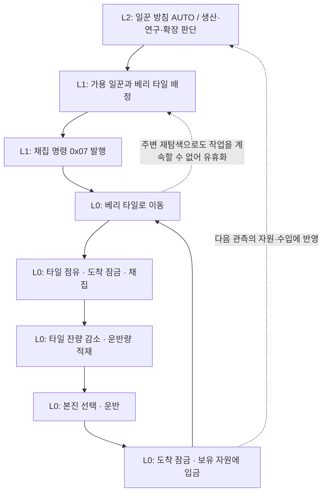

# 쥬라기 원시전 2 강한 AI 봇 설계서 — 관측·행동·보상 중심

작성일 2026-09-05. 대상 코드베이스 `ranker_reconstructed_code`(원본 `ranker.exe` 재구성). 이 문서는 **기존 RL 코드(`ranker_ai_*`, `tools/ai/**`, `docs/RL_*`)를 전제하지 않는다.** 게임 엔진 코드와 원본 데이터 파일만을 근거로 게임을 다시 파악하고, 그 위에 새 봇을 설계한다.

## 0. 이 문서를 읽는 법

- **1부**는 "이 게임이 무엇인가"를 봇 설계에 필요한 만큼만, 그러나 수치까지 정확하게 정리한다. 모든 수치는 재구성 C++ 코드와 원본 데이터(`JW2_09/10/11/12/14.trc`, 셀프플레이 맵)에서 직접 확인한 값이고, 일부는 헤드리스 실행으로 실측했다. 근거 위치는 부록 A에 있다.
- **2부**는 새 봇의 설계다. 핵심은 3~5장(관측·행동·보상)이며, 각 장은 "왜 이렇게 하는가"를 먼저 쓰고 그다음 표로 명세를 적었다.
- **3부**는 학습 파이프라인, 실행 인프라, 상대 일반화 원칙, 마일스톤, 결정 사항(10장, 2026-09-05 확정)이다.
- **목표는 내장 AI 격파가 아니다.** 이 봇은 나중에 사람과도 대전한다. 그래서 관측·행동·보상 어디에도 내장 AI의 내부 규칙(주기·임계값·스크립트 값)을 넣지 않고, 상대에 대한 정보는 전부 "우리가 관측한 행동"에서만 계산한다. 내장 AI는 커리큘럼 첫 단계와 회귀 게이트에 쓰는 훈련 상대 중 하나일 뿐이다(1.8, 5.5, 8장).
- 이전 접근의 실패 원인(유닛별 행 단위 결정, 8프레임 주기, 수십 KB 요청, 파이썬 서버 직렬화)은 사용자 진술과 코드 분석 양쪽에서 확인됐다. 사용자가 유닛별 결정을 없애면서 응답 지연이 정상화된 것도 확인된 사실이며, 이 문서는 그것을 **불변 원칙**으로 굳히고 한 단계 더 나아간다(추론을 엔진 프로세스 안으로).

### 한 줄 요약

> 정책은 **32프레임(≈1.5게임초)마다 8개의 작은 이산 헤드**(무엇을 만들까 / 어느 분대에 어떤 의도를 / 어떤 앵커로 / 얼마나 공격적으로)만 결정하고, 유닛별 명령·채집·건설 위치·교전 마이크로는 **엔진 안의 결정론적 실행기**가 처리한다. 추론은 엔진 프로세스 안의 작은 C++ 순전파(결정당 1ms 미만)로 하고, 보상은 승패 ±1에 **포텐셜 기반 셰이핑**만 얹으며, 같은 행동 공간의 **규칙 커맨더로 BC → PPO → 커리큘럼 → 리그** 순으로 학습한다.

---

# 1부. 게임 이해 — 봇 설계에 필요한 만큼만, 그러나 정확하게

## 1.1 어떤 게임인가

`ranker.exe`는 **쥬라기 원시전 2**(Jurassic War 2, 이하 JW2)다. 구조는 한 줄로 요약된다.

> **베리(열매) 한 가지 자원**을 일꾼이 채집해 **본진에만** 납품하고, 그 돈으로 건물·유닛·연구를 사서, **상대의 건물을 전부 부수면** 이긴다.

4개 종족이 있고 유닛 종류 번호(`type id`)만 봐도 종족과 분류를 알 수 있다.

| type id 범위 | 의미 | 예 |
|---|---|---|
| `0x00`~`0x3f` | 종족별 유닛 16종 블록 (`종족 = type >> 4`) | `0x20`~`0x2f` = 티라노 유닛 |
| `0x60`~`0x9f` | 종족별 건물 16종 블록 (`종족 = (type−0x60) >> 4`) | `0x80`~`0x8f` = 티라노 건물 |
| `0x40`~`0x50` | 야생 공룡 (중립, owner 8) | 티라노사우루스 `0x40` |
| `0xa0`~`0xa4` | 고정형 공격 식물, 캠페인 구조물 | |

| 종족 id | 이름 | 일꾼 | 본진(창고) | 인구 건물 | 타워 | 영웅 |
|---|---|---|---|---|---|---|
| 0 | Primitive 원시인 | `0x00` 빌드맨 | `0x60` 생츄어리 | `0x62` 하우스 | `0x63` 스톤타워 | `0x09` 치프 |
| 1 | Elf 엘프 | `0x10` 위저드 | `0x70` 헤븐 | `0x72` 엘프트리 | `0x73` 버블 | `0x1b` 엔젤엘프 |
| 2 | Tyrano 티라노 | `0x20` 다이노스 | `0x80` 티라노네스트 | `0x82` 네스트 | `0x83` 에스코모이드 | `0x2c` 티라노스 |
| 3 | Demon 데몬 | `0x30` 인섹트 | `0x90` 데몬덴 | `0x92` 툼 | `0x93` 볼케이노 | `0x3a` 데빌 |

현재 셀프플레이 런처는 봇 종족을 **티라노(2)** 로 고정하고, 상대 종족은 `-AITRIBE:N`으로 고른다. 이 문서의 설계는 티라노를 기준으로 쓰되, 종족 의존 부분은 표로 분리했다.

### 티라노 유닛 (레벨 0 정의값)

| type | 이름 | 비용 | 인구 | 생산 틱 | HP / 공 / 방 | 사거리(지상/대공 px) | 공격 주기(틱) | 속도(px/프레임) | 역할 · 특이사항 | 생산 건물 · 선행 |
|---|---|---|---|---|---|---|---|---|---|---|
| `0x20` | 다이노스 | 100 | 1 | 220 | 120 / 10 / 0 | 50 | 8+20 | 5.0 | 일꾼(채집·건설·수리) | 본진 |
| `0x21` | 마소스 | 100 | 1 | 310 | 160 / 15 / 0 | 50 | 9+14 | **7.67** | 저가 근접, 빠름, 대공 불가. 동일 **비용** 효율은 최상이나 1v1은 전패, 인구 효율 낮음 | 에그네스트 |
| `0x22` | 벨로시스 | 250 | 1 | 450 | 290 / 40 / 0 | 50 | 8+21 | 5.19 | **핵심 근접**(동일 **인구** 효율 최상: 4종족 기본 유닛 전부에 우세), 트윈 합체, 대공 불가, 건물 50%/일꾼 75% | 에그네스트 |
| `0x23` | 트윈 벨로시스 | (합체) | 2 | 250 | 460 / 70 / 2 | 50/35 | 12+25 | **8.17** | 벨로시스 2기 합체, 티라노 지상 최속 | (UI 게이트: 랜드네스트) |
| `0x24` | 딜로포스 | 250 | 2 | 440 | 210 / 25 / 0 | 230/250 | 13+21 | 5.33 | 원거리, **대공 가능**(초반 대공 2갈래 중 하나) | 에그네스트 · 랜드네스트 |
| `0x25` | 람포스 | 300 | 1 | 440 | 200 / 30 / 0 | 250/280 | 11+32 | 7.0(양용) | 육수양용, **대공 가능**(초반 대공 다른 갈래), 트윈 합체 | 에그네스트 · 스카이네스트 |
| `0x26` | 트윈 람포스 | (합체) | 2 | 200 | 400 / 30 / 3 | 0/260 | 0+30 | 9.0(공중, 가속 81f) | 공중, 정의상 대공 전용. **임팩트 프레임이 0이라 실제 공격 발동 여부는 미실측** | (스카이네스트) |
| `0x27` | 프테라스 | 450 | 2 | 675 | 275 / 40 / 0 | 170/235 | 12+33 | 7.0(공중, 가속 28f) | 공중, 대공 가능, 건물 75% | 에그네스트 · 스카이+업그레이드네스트 |
| `0x2d` | 트윈 프테라스 | (합체) | 4 | 250 | 360 / 20 / 0 | 310/0 | 12+55 | 6.0(공중) | 공중 대지 전용(대공 불가), 사이클당 10타로 **중장 보병에 최강**(vs 나이트 DPS 42.7). 건물 50%라 공성엔 부적합 | (스카이니스도스) |
| `0x28` | 트리세스 | 800 | 4 | 940 | 425 / 70 / 0 | 230 | 18+25 | 4.69 | 중장(체인 공격), 건물 철거 2위, **변신 불가** | 에그네스트 · 랜드니스도스 |
| `0x2e` | 켄트로스 | 600 | 3 | 850 | 350 / 40 / 0 | 170 | 10+60 | 7.67 | 중장이나 DPS 12.6으로 최저급, 대공 불가, 기동용 | 에그네스트 · 랜드+업그레이드네스트 |
| `0x2a` | 에그 스로워 | 600 | 4 | 725 | 370 / 120 / 0 | 430 | 55+40 | 3.5 | **공성**(건물 150%, 범위 48px), 대공 불가, 회복 없음 | 스로우네스트 · 랜드네스트 |
| `0x29` | 둥가리 | 400 | 2 | 500 | 500 / 0 / 0 | — | — | 7.0(공중, 가속 42f) | 수송(용량 16), 공격 불가, 탑승 중 무적 | 스로우네스트 · 스카이네스트 |
| `0x2b` | 뮤턴트 | (삼합체) | 8 | 250 | 900 / 120 / 0 | 250/250 | 16+35 | 6.0(공중) | 딜로포스+프테라스+트리세스, 건물 철거 1위 | (연구 0x18) |
| `0x2c` | 티라노스 | 5000 | 25 | 3000 | 2000 / 200 / 25 | 50/35 | 10+20 | 7.25 | 영웅, 대공 가능, DPS 146.7 | 본진 · 테크 5종 |

("공격 주기"는 애니메이션 사이클 + 회복 틱. 22틱 = 1게임초. 공중 유닛은 최고속까지 가속 구간이 있다. 대공 가능 여부는 `JW2_12` 프로필의 대상 마스크로 확정한 값이며, 에스코모이드 타워도 대공 가능하다.)

### 티라노 건물

| type | 건물 | 비용 | 건설 틱 | HP | 인구 공급 | 크기(타일) | 선행 | 기능 |
|---|---|---|---|---|---|---|---|---|
| `0x80` | 티라노 네스트(본진) | 1000 | 2100 | 2500 | 9 | 6×4 | 없음 | 창고, 일꾼·영웅 생산, 연구 0x14(채집) 0x2a(변신) 0x38(헤이스트) 0x2b(레벨업 비용) |
| `0x82` | 네스트 | 200 | 400 | 450 | 8 | 3×2 | 없음 | 인구 |
| `0x83` | 에스코모이드(타워) | 350 | 650 | 450 | 0 | 2×2 | 에그네스트 | 사거리 330, 공 40, 주기 9+20(DPS≈30) |
| `0x84` | 에그 네스트 | 400 | 800 | 1600 | 1 | 4×2 | 본진 | **유닛 생산 전부**(마소스·벨로시스·딜로포스·람포스·프테라스·트리세스·켄트로스) |
| `0x85` | 랜드 네스트 | 600 | 1400 | 1600 | 1 | 4×3 | 에그네스트 | 지상 공/방 연구 0x19/0x1a 발주(5레벨, 비용 200/400/600/800/1000, 1800+400·레벨 틱; **레벨 1~2는 선행 면제, 3~5레벨은 랜드 니스도스 필요**), 이속 0x16 |
| `0x86` | 스카이 네스트 | 600 | 1400 | 1600 | 1 | 4×3 | 에그네스트 | 공중 공/방 0x1c/0x1d 발주(3레벨부터 스카이 니스도스 필요), 뮤턴트 0x18 (**연구 전용**, 생산 없음) |
| `0x87` | 스로우 네스트 | 400 | 950 | 1800 | 0 | 5×3 | 에그네스트 | 에그스로워·둥가리 생산 |
| `0x88` | 업그레이드 네스트 | 500 | 1150 | 1500 | 1 | 5×3 | 랜드 **또는** 스카이 | 상위 테크 게이트 |
| `0x89` | 랜드 니스도스 | 800 | 1750 | 1800 | 1 | 4×3 | 랜드+업그레이드 | 연구 전용(생산 없음): 근접 강화 0x1b, 트리세스 이속 0x2d. **게이트 역할**: 트리세스 생산 선행(생산은 에그네스트), 지상 공/방 3~5레벨, 티라노스 선행 |
| `0x8a` | 스카이 니스도스 | 800 | 1750 | 1800 | 1 | 4×3 | 스카이+업그레이드 | 연구 전용: 공중 강화 0x1e. **게이트 역할**: 트윈 프테라스(UI), 공중 공/방 3~5레벨, 티라노스 선행 |

전체 170종의 스탯은 `units_dump.txt`, 연구 59종은 `orders_dump.txt`, 상성표는 `damage_matrix.md`에 덤프돼 있다(부록 A).

## 1.2 시간 — 프레임이 유일한 시계

시뮬레이션은 **프레임** 단위로 진행되며 벽시계와 분리되어 있다. 설계에서 쓰는 시간 상수는 다음뿐이다.

| 상수 | 값 | 의미 |
|---|---|---|
| 게임 1초 | **22 프레임** | 내부 시계(`frame % 0x16`)의 초 단위 |
| 정상 플레이 최고속 | 45 ms/프레임 | 사람이 보는 속도. 학습에서는 무시 |
| 승패 판정 주기 | 64 프레임 | 건물 0인 오너 탈락 |
| 시야 잔상 클리어 | 64 프레임 | "지금 보임" 비트가 지워지는 주기 |
| 게임 상한 | 60000 프레임 ≈ 45분 | 하네스 `-MAXFRAMES`(사용자 결정). 엔진 자체 타임아웃 없음 |

**헤드리스 실측 속도**(`-AISELF`, 7950X, 2026-09-05): 단일 인스턴스 초반 403 fps, 유닛 130기 시점 308 fps(프레임당 CPU 1.0~1.4 ms + `Sleep(1)` ≈1.1 ms). 8개 동시 실행 시 인스턴스당 364 fps(합산 2915), 16개 동시엔 242 fps(합산 3870)이나 시작에 53초가 걸려 수확 체감. 60000프레임 게임은 단일 약 190초. 시뮬은 단일 워커 스레드다.

한 프레임은 다음 순서로 처리된다. 봇의 훅이 어디에 끼는지가 지연을 결정한다.

```
pre_update  : 입력 처리, [봇 훅: 관측 → 결정 → 패킷 발행]
frame_gate  : 패킷 디스패치  ← AI 채널 패킷은 이 프레임에 즉시 적용 (사람 채널은 +6프레임)
phase 0     : 공간 인덱스 재구축, 승패 판정(64프레임마다)
phase 1     : 내장 AI 유지보수 → 유닛 명령 틱 → 라이프사이클 → 맵 이펙트 → 시야 갱신
phase 2     : 데미지 적용
phase 3     : 자동 타깃 선택
…           : 사운드/음악/플라이트 레코더
present     : 렌더(헤드리스는 no-op) → Sleep(1)
```

**결정론**: 시뮬레이션 난수는 `std::rand`가 아니라 자체 생성기이고 시드는 세션마다 0에서 출발한다. `-SEED`는 시작 위치 순열(1v1이면 4×3=12가지)과 `-AITRIBE:4`의 종족만 바꾼다. 따라서 같은 설정·같은 결정을 내리는 봇은 같은 게임을 만든다(실측: 같은 시드 3회 결과 JSON md5 동일). 이 사실은 평가 프로토콜(3부 7장)을 좌우한다.

## 1.3 경제 — 베리 하나, 인구 둘

**자원은 실질적으로 하나(베리, primary)** 다. 2차·보조 자원 필드가 있지만 모든 유닛·건물·연구의 2차 비용이 0이다.

### 채집 사이클 (일꾼 1기, 티라노 다이노스 기준)

```
베리 타일로 이동 → 도착 잠금 4틱 → 채집 애니메이션 48틱 → 12(연구 후 16) 적재
→ 가장 가까운 "본진"으로 이동 → 도착 잠금 4틱 → 입금 → 원래 타일로 복귀
```

- 타일은 **채집 중(48+4틱)에만** 일꾼 1명이 점유한다. 왕복 중에는 풀리므로 같은 타일에 일꾼 2~3명을 배정해도 엔진이 인접 타일 탐색·대기(0x2d)로 처리한다. 베리 8타일짜리 본진이라면 **타일당 2.5명 ≈ 20명**이 실용 상한이다.
- 납품처는 **본진 건물(`0x80` 계열)** 뿐이다. 인구 건물은 창고가 아니다. 즉 "확장"이란 베리 근처에 **본진을 하나 더 짓는 것**(1000원, 2100틱)이다.
- 채집량 연구(티라노 0x14, 500원, 1400틱)로 12→16.
- 수입 추정: 왕복 약 150틱, 회당 12 → 일꾼 1기 ≈ 0.08/프레임 ≈ **1.8베리/초**, 20기 ≈ 35베리/초. 본진 창의 32000베리는 20명이 약 19,500프레임에 고갈된다 → 12,000~15,000프레임에 확장이 필요하다.

### 인구 — "한도"와 "공급"이 다르다

| 값 | 계산 | 봇 관점 |
|---|---|---|
| 공급 `population_used` | 완공 건물의 인구 값 합 (본진 9, 네스트 8, 생산 건물 1) | 늘리려면 네스트를 지어야 함 |
| 소비 `population_reserved` | 살아 있는 유닛의 인구 합 + 지금 생산 중(상태 0x51)인 유닛 | **큐에서 대기 중인 유닛은 아직 세지 않음** → 봇이 더해서 계산해야 정체를 막는다 |
| 한도 `population_limit` | 180 고정 | 사실상 도달하지 않음 |

생산이 통과하려면 `소비 + 유닛인구 ≤ 공급` 이고 `≤ 한도` 여야 한다. 실패하면 조용히 거부되거나(큐 초과) 메시지만 나온다.

### 돈이 나가는 시점과 돌아오는 규칙

| 행위 | 차감 시점 | 취소·실패 시 |
|---|---|---|
| 유닛 생산 | 명령 패킷을 받는 순간(큐에 들어갈 때) | 취소하면 전액 환불. 생산 건물이 파괴되면 1차만 환불 |
| 건물 건설 | 일꾼이 지점에 **도착해 건물이 생기는 순간** | 자기 취소(subtype 0x07) 75% 환불. 적에게 파괴되면 0 |
| 연구 | 발주 즉시 | 취소 시 전액 환불 |

큐 상한: 건물당 유닛 생산 큐 **4**(초과는 무음 거부), 연구 큐 10, 유닛당 명령 예약(shift) 큐 10.

### 고기와 사냥

야생 공룡(owner 8)을 잡으면 **고기**를 떨어뜨린다(티라노사우루스 550, 브라키오사우루스 650, 벨로시랩터 200). 고기는 자원이 아니라 유닛이 주워 **HP 회복 재료**(8프레임마다 1 소모해 HP+1)이자 종족 토글(헤이스트) 연료로 쓴다. 더 중요한 것은 **경험치**다. 킬 경험치는 피살자의 인구 값이며 야생 공룡은 10~45로 매우 크다(일반 적 유닛 1~4). 셀프플레이 맵의 각 시작 위치 20타일 안에는 **공격하지 않는 초식 공룡 8~11기**(브라키오 HP1500/공0/경험치30, 스테고, 파라사우롤로푸스…)가 있어 무손실 레벨업이 가능하다.

## 1.4 전투 — 공식은 단순하고, 상성은 표에 있다

| 항목 | 규칙 |
|---|---|
| 데미지 | `(공격 OP + 연구 + 버프) − (방어 DP + 연구 + 버프)`. 1 미만이면 확률 `1/((2·DP)/OP)`로 1, 아니면 0. 그 뒤 **상성 퍼센트 두 개**(타깃의 투사체 클래스 ×, 타깃의 렌더 클래스 ×)를 곱하고 최소 1 |
| 공격 주기 | `애니메이션 사이클 + 회복 틱`. 회복은 레벨·연구로 줄어듦 |
| 사거리 | 기본값(공중 대상은 별도 값) + 레벨 보너스 + 연구. 거리는 `max(|dx|,|dy|) + min/4` (픽셀, 타일 32px) |
| 건설 중 건물 | 받는 피해 2배, 반격 없음, 파괴돼도 환불 없음 |
| 실드·버프 | 실드가 먼저 흡수. 종족 토글은 `command_flags` 비트로 스탯 보정 |

**티라노 상성 요점**(`JW2_12` 실측): 마소스·벨로시스·트윈벨로시스·켄트로스·에그스로워·트윈프테라스는 **공중을 때릴 수 없다**(대상 마스크에 공중 클래스 없음). 대공 가능은 딜로포스(250)·람포스(280)·프테라스(235)·뮤턴트·티라노스, 그리고 에스코모이드 타워다. 벨로시스는 건물에 50%·일꾼에 75%, 프테라스는 건물 75%, 에그스로워는 건물에 150%·범위 48px. 건물 철거 속도는 뮤턴트 > 에그스로워 > 트리세스 순이다. 동일 **비용** 기준 Lanchester 비율은 마소스가 가장 높고 벨로시스도 엘프 레인저(0.79)를 제외한 4종족 기본 유닛 전부에 우세(1.19~2.72)하며, 동일 **인구** 기준으로는 벨로시스가 전부에 우세하고 마소스는 1인구 적에게 열세다. 트윈 벨로시스는 양쪽 기준 모두 전부에 우세하다. 데몬 머드맨(DPS 55)이 단일 최대 위협이다.

**세 가지 반경을 구분해야 한다** (모두 유닛 정의값, 픽셀):

| 반경 | 필드 | 대표값 | 쓰임 |
|---|---|---|---|
| 시야 | `+0x198` | 유닛 350(10타일), 본진 525(16타일) | 안개 해제. 32로 나눈 값이 타일 반경 |
| 자동 타깃 획득 | `+0x19c` | 일꾼 150, 전투유닛 200~450 | 유휴 유닛이 32프레임마다 이 안에서 적을 찾음 |
| 공격 사거리 | `+0x1b0` | 근접 50, 딜로포스 230, 에그스로워 430 | 타격 가능 거리 |

자동 타깃은 `target_selection_priority`가 낮을수록 우선(유닛·일꾼·타워 40 < 수송·지원 50 < 일반 건물 60 < 식물 75), 동률이면 가까운 것이다. 사거리 밖이면 추격하고, **건물과 타워는 추격하지 않는다**.

피격 반응 규칙은 봇의 마이크로 설계에 직접 영향을 준다.

| 피격 유닛의 상태 | 반응 |
|---|---|
| 유휴/이동 중 | 공격자를 새 타깃으로 잡음(사거리 밖이면 추격) |
| 이미 전투 중 | 우선순위가 더 중요하거나 같으면서 더 가까운 공격자로만 교체 |
| 경비 복귀 중 | 무조건 공격자로 교체 |
| 비전투 유닛(일꾼 등) | ±64px 랜덤 도주 |
| 피격 유닛 주변 아군 | 시야 반경 절반 안의 아군이 같은 규칙으로 동참 |

**레벨**: 킬 경험치가 쌓이면 `production_variant`가 오르고 HP/공/방이 오르며 회복 틱이 줄고 사거리 보너스가 붙는다(벨로시스 임계 8+2·레벨). 티라노 유닛은 에그스로워·둥가리를 빼면 레벨업이 가능하다.

**회복**: 티라노 유닛은 고기가 없어도 32프레임마다 HP 1 회복(원시인·엘프·데몬은 고기로만 회복). 에그스로워는 회복이 전혀 없다. MP는 16프레임마다 1.

## 1.5 시야 — 봇이 스스로 지켜야 하는 규칙

엔진은 **모든 유닛을 항상 시뮬레이션**한다. 안개는 렌더와 자동 타깃, 그리고 공격 명령 검증에 걸린다. 엔진 메모리를 읽는 봇은 원리상 전지적이므로, 공정성은 봇 코드가 지켜야 한다.

- 시야 그리드는 owner별 비트다. `grid.owner[tile] & (1<<owner)` = 지금 보임, `& (1<<(owner+16))` = 탐사됨. 모든 오너에 대해 매 프레임 유지되므로 봇이 재계산할 필요가 없다.
- "지금 보임" 비트는 **64프레임마다만 지워지므로** 적이 시야를 벗어나도 최대 63프레임 동안 보이는 것으로 남는다. 결정 프레임을 64k+1에 맞추면 잔상이 0~1프레임이 된다.
- 지형 클래스(고지)가 유닛보다 높으면 그 방향 시야가 막힌다. 공중 유닛은 전부 본다. 셀프플레이 맵의 시작 4곳은 모두 고지(클래스 2) 위다.
- 안개 밑 적 유닛은 "고스트"조차 남지 않는다. 마지막으로 본 위치를 기억하는 것은 봇의 몫이다.
- **안개 속 대상에 명령을 내리면**(실측·코드): 공격 명령(`0x05`/`0x0d`)에 비가시 id를 주면 접근조차 없이 **명령이 폐기되고 유닛은 유휴**로 떨어진다. 접근 중 시야를 잃어도 즉시 유휴. 반면 **이동 명령(`0x04`)에 적 id를 주면 안개 속 적을 그대로 추적**한다(정보 누출). 어택무브(지점)는 안전하다. → 봇은 대상 id 공격은 가시 대상에만, 이동은 지점에만 쓴다.
- 내장 AI는 전장 전체를 본다(가시성 검사 없음). 자원 치트는 없다.

## 1.6 명령 시스템 — 행동 공간의 물리적 하한

플레이어(봇 포함)가 게임에 줄 수 있는 모든 입력은 **36바이트 패킷 한 종류**다.

```
(subtype, owner, command, unit_offset, mode, arg1, arg2)
```

- **패킷 하나 = 유닛 하나.** 12기 이동은 12패킷이다(사람 UI가 유닛마다 하나씩 보낸다). 링 용량은 채널당 2048.
- 봇 채널(로컬 시뮬레이션 AI 채널)의 패킷은 **같은 프레임에 적용**된다(지연 0).
- `command` 최상위 비트(0x80000000)는 **shift 예약**이다. 없으면 기존 예약 큐를 비우고 즉시 교체.

| subtype | 의미 | 주요 인자 |
|---|---|---|
| `0x02` | 기본 유닛 명령 | command: `0x00` 정지, `0x04` 이동(x,y), `0x05` 공격/어택무브(대상 id 또는 지점), `0x06` 건설(mode=건물type−0x60, 좌표 32px 정렬), `0x07` 채집(타일), `0x09` 순찰, `0x0a` 수송 탑승, `0x0b` 합체(mode=짝 id), `0x0d` 대상 지정 공격(사냥 마커와 함께), `0x11`/`0x1b` 변신/해제, `0x14` 헤이스트 토글(mode 0 켬/1 끔), `0x24` 하차 |
| `0x01` | 유닛 생산 | command=유닛 type, unit_offset=생산 건물. mode=1이면 취소 |
| `0x0c` | 연구 | command=order id, unit_offset=연구 건물 |
| `0x08` | 랠리 | command=0x1f, x,y(생산 완료 유닛이 여기로 이동) |
| `0x0b` | 사냥 마커 | command=0x0d, mode=0x80000000 → 야생 공룡만 자동 공격·고기 자동 습득 |
| `0x0a` | 홀드 | |
| `0x07` | 건설 취소(75% 환불) | |
| `0x14` | 동맹·시야 마스크 설정 | -AIVS 시작 시 관계 고정용 |
| `0x13` | 항복 | (행동 공간에서 제외) |

수신 측 검증(모든 피어가 동일하게 수행):

| 명령 | 검사 |
|---|---|
| 생산 | 자원 → 인구 한도 → 인구 공급 → 선행 건물 (큐 4개 초과면 검사 전에 조용히 거부) |
| 연구 | 최대 레벨 → 진행 중 락 → 선행 건물(공/방 연구는 **레벨 1~2에서 선행 면제**) → 자원 |
| 건설 배치 | 지형 차단 비트, 탐사됨 비트, 지형 클래스가 원점 셀과 동일, 유닛 충돌, **본진은 ±4타일 안에 베리 타일이 있으면 불가**. 일꾼과의 거리 제한은 없음 |
| 합체 | 두 유닛이 서로를 대상으로 명령, 중심 거리 ≤10px, 인구 게이트만. 선행 건물·연구 0x18은 **UI에서만** 검사 |
| 변신 | `morph_type_id`와 `type_flags 0x20000`만. 연구 0x2a는 **UI에서만** 검사 |
| 헤이스트 | 고기(action_mode) > 1. 연구 0x38은 **UI에서만** 검사 |

명령이 **받아들여져도 바로 실행되지 않는 경우**: 공격 사이클 진행 중(`command_flags & 0x10`), 변신 중, 합체 중, 스턴(`command_state & 0x40000000`), 탑승 중. 이때 명령은 pending에 머물다가 풀리면 실행된다.

건설은 **일꾼이 건물 안에 들어가** 완공까지 나오지 못한다(티라노 포함 비엘프). 추가 일꾼은 cmd 0x03(수리)으로 4프레임마다 한 단계씩 진행을 보탤 수 있다. 완공 전 건물은 선행 조건으로 인정되지 않는다.

## 1.7 승패·세션·맵

- **패배**: 트랩을 제외한 건물이 하나도 없으면(64프레임 주기 판정). 유닛만 남으면 진 것이다.
- **승리**: 적대 오너 전원이 탈락. 1800프레임 이전의 종료는 정식 승패가 아니라 "무효(2)"로 기록된다.
- 셀프플레이 로비: 슬롯 0 관전 호스트, 슬롯 1 Computer(AI)=봇(티라노), 나머지 시작 위치는 내장 Computer. 세션 모드 0(Top vs Bottom)의 반분 규칙 덕에 봇과 내장 AI가 "우연히" 적대가 되므로, 새 설계는 시작 프레임에 subtype 0x14로 관계를 명시 고정한다. `-AIVS`로 슬롯 2도 봇으로 만들면 봇 대 봇.
- 시작 상태: 본진 1 + 일꾼 5, 자원 **400**(맵 기본; `-AISELF`에는 시작 자원 옵션이 없다).

### 셀프플레이 맵 `(4) Python Jurassic v0.1` 정적 분석

| 항목 | 값 |
|---|---|
| 크기 | **128×128 타일 = 4096×4096 px** (셀 버퍼 stride는 256) |
| 시작 위치(타일) | S0 (79,8), S1 (112,38), S2 (42,116), S3 (9,86). 모두 고지(클래스 2) |
| 본진 창(반경 15타일) 베리 | 4곳 모두 **8타일 / 32,000** (완전 대칭). 최근접 베리 5~7타일 |
| 채집 가능 베리 | 100타일 / 392,030. 14개 클러스터. NE·SW 섬 2개(56,030)는 지상 도달 불가 |
| 자연 확장 | S0→C3 (41,4), S1→C7 (124,75), S2→C13 (86,124), S3→C6 (2,55): 각 7타일/28,000, 28~36 BFS스텝 |
| 경합 클러스터 | C5 (83,37) S0/S1, C0 (6,5) S3/S0, C9 (42,92) S3/S2, C11 (120,122) S1/S2 |
| 지형 | 통행 78%, 물 6%, 절벽 14%. **S0·S1은 폭 ≤2타일 램프 1개((54,6), (116,65))뿐인 폐쇄 고원**, S2·S3는 개방형 |
| 시작 쌍 거리 | S0–S1, S2–S3는 픽셀상 1296이나 지상 경로는 130~135스텝(물·절벽 우회). 나머지 119~171스텝 |
| 야생 공룡 | 138기. 시작 20타일 내 8~11기, 전부 비공격형(고기 ≈1160, 경험치 45~63) |
| 엔진 경로탐색 | 방문 예산 5461·오픈리스트 1024의 그리디 탐색. S0↔S1처럼 직선이 막힌 장거리는 실패 후 최선 타일로 목표가 바뀔 수 있음 → 봇은 램프/출구를 웨이포인트로 주는 편이 안전 |

시작 슬롯은 `-SEED` 순열로 배정되므로 봇이 폐쇄 고원(S0/S1)인지 개방형(S2/S3)인지에 따라 방어 배치가 달라져야 한다. 관측에 자기 시작 슬롯 원핫을 넣는 이유다.

## 1.8 내장 AI — 훈련 상대 중 하나일 뿐

내장 Computer는 `Jw2_14.trc`의 텍스트 스크립트로 움직이는 규칙 기반 AI다. 설계와 학습에서 알아야 할 것은 다음 세 가지뿐이다.

- **결정적이고 주기적이다.** 고정 주기로 사고하고, 공격·확장·방어가 몇 개의 임계값으로 정해진다. 그래서 이 상대만 겨냥해 학습하면 정책이 그 주기와 임계값을 외워 버리고 사람 상대로는 무너진다. 이 문서는 내장 AI의 세부 규칙을 관측 피처·행동·보상에 **넣지 않는다**.
- **전장 전체를 본다.** 시야 검사 없이 모든 유닛을 참조한다. 자원 치트는 없다. 우리는 시야 규칙을 지키므로 정보에서는 불리하다. 이 조건에서도 이겨야 사람 상대로도 통한다.
- **초반 벤치마크로만 쓴다.** 무작위 초기 정책이 승리를 관측할 수 있는 가장 싼 상대이므로 커리큘럼의 첫 단계와 회귀 게이트에 쓰고, 이후에는 셀프플레이 리그와 변형 상대가 주가 된다(5.5, 6.4).

내장 AI의 스크립트·틱·공격 게이트·카운터 테이블 같은 상세 분석은 `docs/ai_bot_design_data/analysis/builtin-ai.md`에 따로 있다. 상대 모델링이 필요할 때 참고하되, 그 값을 하드코딩하는 것은 금지한다.

## 1.9 티라노 고유 메커니즘 (코드·데이터로 확정)

| 메커니즘 | 규칙 |
|---|---|
| 특수능력 | **없다.** 티라노 유닛 전부 능력 비트가 0(능력은 원시인 치프/칼마, 엘프 9종, 데몬 8종만) |
| 트윈 합체 (cmd 0x0b) | 같은 종류 2기가 **서로를** 대상으로 명령(2패킷), 중심 거리 ≤10px → 결과 유닛의 생산 시간(250틱, 트윈람포스 200틱) 동안 정지·노출 → 결과 정의 스탯(HP 비율 유지, 레벨 평균, 고기 합산). 인구는 정의값(1+1→2). 엔진은 거리·인구만 검사하고 선행 건물은 UI에서만 |
| 뮤턴트 삼합체 | 딜로포스+프테라스+트리세스가 3-사이클로 서로 지정. 연구 0x18(스카이네스트 300원)은 UI 게이트 |
| 공룡 변신 (cmd 0x11 / 0x1b) | 16프레임, 비용 없음. 스탯·레벨·인구 유지, 속도·사거리는 야생형 값. **변신 중 자동 타깃·반격 불가**(`type_flags=0x08002011`), 연구 보너스 상실. 트리세스는 변신 **불가**. 람포스·프테라스·켄트로스 야생형은 공격 불가. 딜로포스 야생형은 이동 1.56→2.42px/f, 사거리 150 → 사실상 "고속 이동 폼"으로만 가치 |
| 헤이스트 토글 (cmd 0x14) | 고기 >1 필요, 켜면 고기 −1 후 8프레임마다 고기 1 소모. 효과: 지상 이동 축당 +1px/프레임, 공중 step +1. 연구 0x38은 UI 게이트 |
| 자연 회복 | 고기 없이도 32프레임당 HP+1 → 후퇴·재정비의 가치가 다른 종족보다 큼 |
| 사냥 | 사냥 마커(subtype 0x0b bit31)를 켜면 야생 공룡만 자동 공격하고 고기를 자동 습득. 초식 공룡 사냥은 무손실 레벨업 |
| 수송(둥가리) | 용량 16, 승객 크기 벨로시스 2·트리세스 3·에그스로워 4·티라노스 8. 공중 유닛(프테라스·트윈·뮤턴트)은 탑승 불가. 탑승 중 피격 불가, 수송선 사망 시 전원 사망(단, 숨겨진 승객이 사망 콜백에 도달해 손실로 집계되는지는 미확인 — M0 실측, 10.13). 하차 1기/약 3프레임 |


---

# 2부. 새 봇 설계 — 관측·행동·보상

## 2. 설계 원칙: 왜 이 모양인가

### 2.1 이전 접근이 실패한 이유 (사용자 진술 + 코드 확인)

| 증상 | 원인 | 새 설계의 처방 |
|---|---|---|
| 정책 서버 응답 200ms (8인스턴스) | 결정마다 유닛별 행(최대 2048)을 57KB 요청으로 보내고, 파이썬 서버가 전역 락 + torch 스레드 1개로 8연결을 직렬화하며, 순수 파이썬으로 행 단위 파싱, C++는 결정마다 맵 전체 타일과 시야를 재구성 | **결정 = 고정 크기 벡터 하나**, 유닛별 명령은 정책이 내지 않음(불변 원칙). 추론을 **엔진 프로세스 안**의 C++ 순전파로(소켓·직렬화·락 없음). 시야는 엔진이 이미 유지하는 owner 비트를 읽기만 함 |
| 학습이 안 됨 | 8프레임마다 결정(게임당 7500회) × 유닛별 행 액션 = 신용 할당 불가; 희소한 승패 보상; 무작위 초기 정책은 승리를 거의 못 봄 | 32프레임 결정(게임당 ≈2000회) × 95개 로짓; 포텐셜 셰이핑; 같은 행동 공간의 **규칙 커맨더로 BC 초기화**(승률 80% 분포에서 출발); 특권 크리틱 |

사용자가 유닛별 결정을 부대 단위로 바꾸자 응답이 정상화된 것은 위 표의 첫 행을 실증한다. 새 설계는 그 원칙을 유지한 채 정책 위치까지 옮겨 원인을 구조적으로 없앤다.

### 2.2 세 개의 층

**L2는 방침을 고르고, L1은 그 방침을 유닛별 명령으로 바꾸고, L0는 명령을 실제 게임 상태 변화로 실행한다.** 베리 채집으로 보면 L2는 일꾼 생산·채집 연구·확장·대피를 결정하고, L1은 채집할 일꾼과 타일을 배정하며, L0는 이동·채집·운반·납품을 반복한다.

아래 주기와 헤드는 **이 문서에서 제안하는 새 봇의 설계**다. 현재 실행 중인 RL 경로의 구현 설명은 [현재 RL Flow](RL_FLOW_CURRENT.md)를 기준으로 하며, 두 구조의 차이와 현재 채집 호출 흐름은 2.2.5에 정리했다.

```text
L2 커맨더 (학습, 32프레임 + 이벤트 인터럽트)
   "무엇을 만들까 / 어느 분대에 어떤 의도를 / 어느 앵커로 / 얼마나 공격적으로"
        │  8개 이산 헤드 (95 로짓)
        ▼
L1 실행기 (C++ 결정론, 8프레임)
   채집 배정 · 건물 배치 · 분대 응집/이동 · 포커스/카이팅/후퇴 · 합체 접근 · 랠리 · 정찰
        │  Mode1 패킷 (유닛당 1개, 같은 프레임 적용)
        ▼
L0 엔진 자동화 (변경 없음)
   유휴 자동 타깃(32프레임) · 피격 반격 · 어택무브 재스캔 · 채집 루프 · 경로탐색
```

- **정책이 절대 하지 않는 것**: 유닛 id 선택, 좌표 지정, 채집 타일 배정, 건설 좌표, 포커스 대상. 이것들은 실행기 규칙이며, 같은 관측·의도·실행기 상태에서 같은 패킷과 다음 실행기 상태를 만들도록 설계한다.
- **정책이 하는 것**: 경제/테크/생산 순서(빌드 오더), 분대 3개(MAIN/GUARD/RAID)의 의도·목표 앵커·교전 규칙(ROE), 일꾼 정책, 신규 유닛 배속.
- 실행기 파라미터 중 전략적 의미가 있는 것(후퇴 임계, 공격성)만 정책이 ROE로 고른다. 이렇게 하면 "정책이 무모해서 녹는" 구간과 "실행기가 소극적이라 못 이기는" 구간을 정책이 조절할 수 있다.

#### 2.2.1 각 층은 무엇을 입력받고 무엇을 내보내나

| 층 | 입력 | 출력 | 베리 채집에서 맡는 판단 |
|---|---|---|---|
| **L2 커맨더** | 자원·인구·일꾼 수·수입·본진 주변 잔량·위협 등 요약 관측과 합법성 마스크 | H1~H7 및 H1b의 전략 선택 | 다이노스를 더 생산할지, 채집량 연구를 할지, 새 본진을 지을지, 일꾼을 대피시킬지 |
| **L1 실행기** | L2가 유지 중인 방침, 관측 가능한 개별 유닛·지도 상태, 배정·예약·명령 추적 상태 | 수행할 유닛 id와 대상/좌표가 정해진 합법적인 Mode1 패킷 | 어느 유휴 일꾼을 어느 베리 타일에 보낼지, 누가 건설에 빠질지, 실패한 작업을 언제 재배정할지 |
| **L0 게임 엔진** | 정해진 simulation frame에 처리되는 게임 패킷과 현재 게임 상태 | 다음 프레임의 위치·명령 상태·타일 잔량·운반량·보유 자원 | 실제 경로 이동, 타일 점유, 채집 시간 경과, 본진 탐색, 운반과 납품 |

L2의 `H1=TRAIN 다이노스`는 생산 요청 하나이고, `H6=AUTO`는 일꾼 운용 방침이다. L1은 생산 요청을 처리할 본진을 선택하고, 생산이 끝난 새 일꾼을 발견하면 채집에 배정한다. L0는 본진의 생산 진행과 새 일꾼의 생성까지 실제 게임 규칙에 따라 처리한다.

L1이 보관하는 배정·예약은 봇의 작업 관리 정보다. 게임의 자원이나 타일 점유를 직접 바꾸는 권한을 뜻하지 않는다. 예를 들어 "이 타일에 일꾼 2명을 배정했다"는 L1 정보와 "지금 이 타일을 일꾼 1명이 채집 중이다"라는 L0 점유 정보는 서로 다르다.

L1의 결정론은 기억이 없다는 뜻도 아니다. 마지막 명령, 건설 예약, 정체 프레임 수 등을 명시적으로 입력 상태에 포함한다. 후보 순회와 동률 처리도 고정해야 같은 상황에서 같은 일꾼과 타일이 선택된다. 이 성질은 실행기 재현에 필요하고, L0의 재현에는 같은 초기 게임 상태·게임플레이 RNG 상태·패킷 순서와 적용 프레임이 필요하다.

**세 주기는 따로 돈다.** 일반적인 고정 틱 예시는 다음과 같다. 이벤트에 따른 L2 조기 호출은 2.3의 규칙을 따른다.

| simulation frame | L2 | L1 | L0 |
|---|---|---|---|
| 1 | 새 전략 선택 | 전략 적용, 필요한 유닛에 명령 발행 | 수신 명령 처리와 시뮬레이션 |
| 9, 17, 25 | 앞서 고른 방침 유지 | 유휴 일꾼·실패 작업·위협 확인 | 각 프레임마다 이동·채집·운반 진행 |
| 33 | 다음 전략 선택 | 변경된 방침과 새 상태 반영 | 시뮬레이션 계속 |

L0는 표에 적힌 프레임 사이에도 계속 실행된다. L1의 8프레임 틱은 기존 채집 명령을 8프레임마다 다시 보내라는 뜻이 아니다. 채집이 정상 진행 중이면 발행할 패킷이 없어도 된다. L2가 `NOOP`을 골라도 진행 중인 생산이나 채집은 계속된다.

#### 2.2.2 베리 채집 한 바퀴: 새 봇에서의 역할 분담

아래는 이 문서의 기준 종족인 **티라노 다이노스(`0x20`)**의 정상 경로다. L1 배정 방식은 설계안이고, L0 채집·납품 과정은 현재 재구성 엔진 코드에 있는 동작이다.



1. **L2가 경제 방침을 정한다.** 기본 `H6=AUTO`이면 L1이 유휴 일꾼을 채집에 투입한다. L2가 매 왕복마다 HARVEST를 선택할 필요는 없다. 일꾼 수를 늘리는 `TRAIN 다이노스`, 회당 채집량을 늘리는 `RESEARCH 0x14`, 납품 거리를 줄이는 `BUILD 본진`은 별도의 전략 결정이다.
2. **L1이 일꾼과 타일을 배정한다.** 건설·정찰 등 다른 작업에 묶이지 않은 유휴 일꾼을 확인하고, 가까운 본진의 반경 15타일 창에서 잔량이 있는 베리 타일을 찾는다. 설계상 잔량 500 미만은 우선순위를 낮추고, 한 창에 일꾼이 과도하게 몰리면 다른 본진 창을 사용한다. `타일당 2.5명`은 배정 목표 비율이다. 8타일이면 총 20명을 정수 인원으로 분산한다는 뜻이며, 엔진의 동시 점유 제한과는 별개다. 이 계수의 수입 효과는 M0 측정 대상이다.
3. **L1이 채집 명령을 한 번 발행한다.** 선택한 일꾼 id와 베리 지점 좌표를 게임 명령 `0x07`로 변환한다. 베리는 지도 타일이므로 이 경로에서는 대상 유닛 id 대신 지점 좌표를 사용한다. 합법성을 확인하고 패킷을 등록한 뒤에는 다음 관측에서 실제 적용 여부를 확인한다.
4. **L0가 이동하고 채집한다.** 도착한 일꾼이 타일을 점유하고 4틱 잠금을 거친다. 다이노스는 정의 데이터의 채집 주기 48틱이 끝나면 타일에서 기본 12, 채집 연구 완료 후 16만큼 꺼낸다. 잔량이 그보다 적으면 남은 만큼만 적재한다. 이때 `cargo_amount`와 운반 플래그가 설정되고 타일 점유는 해제된다. **아직 플레이어가 쓸 수 있는 자원은 증가하지 않는다.**
5. **L0가 본진을 골라 운반한다.** 일반 채집 경로에서는 채집을 마칠 때마다 가까운 자기 소유의 납품 가능 본진을 다시 찾는다. 티라노의 납품처는 완공된 `0x80` 본진이며 `0x82` 인구 건물은 납품처가 아니다. 따라서 L1이 배정할 때 참고한 본진과 실제 납품처는 새 본진의 완공·파괴 등에 따라 달라질 수 있다.
6. **L0가 납품한다.** 본진 경계에 도착해 4틱 잠금을 거친 뒤 `owner_resources[owner] += cargo_amount`와 `owner_resource_score[owner] += cargo_amount`를 수행한다. 이 순간 보유 자원과 누적 채집량이 증가한다. 운반 플래그를 해제하고 저장해 둔 채집 지점으로 돌아가는 경로를 시작한다.
7. **L0가 다음 왕복을 이어간다.** 일꾼이 여전히 채집 작업을 수행할 수 있으면 L1이나 L2의 새 명령 없이 반복한다. 다른 일꾼의 점유·길 막힘·타일 고갈은 먼저 엔진의 주변 타일 탐색과 대기 경로가 처리한다. 작업이 끝나거나 중단되어 다시 가용 상태가 된 일꾼은 L1이 재배정한다. 본진 주변 자원 전체가 부족해지면 그 정보가 L2의 확장 판단에 들어간다.

예를 들어 플레이어 자원이 400이고 업그레이드 전 일꾼 한 명이 12를 땄다면, 운반 중에는 자원이 계속 400이다. 다른 수입·지출이 없을 때 그 일꾼의 본진 납품이 끝나야 412가 된다. 이동 거리·혼잡·타일 대기가 있으므로 한 왕복 시간이 채집 애니메이션 48틱과 같지는 않다.

#### 2.2.3 L0의 실제 상태 전이와 코드 읽는 법

일반적인 왕복은 `0x28 → 0x2a → 0x29 → 0x2c → 0x2b → 0x2a → …`다. 다음 표는 `command_state`의 기본 상태 값이며 도착 잠금 등은 이 흐름에 추가된다.

| 기본 상태 | 실제 역할 | 처리 함수 / 다음 단계 |
|---|---|---|
| `0x28` | 채집 명령 시작, 목적지와 경로 준비 | `ProcessWorkerReturnToDropoff()` → 보통 `0x2a`; 이미 운반 중이면 본진 접근으로 분기 가능 |
| `0x2a` | 베리 지점으로 이동 또는 납품 후 복귀 | `ProcessWorkerApproachHarvestTile()` → 도착 시 점유·4틱 잠금, `0x29` |
| `0x29` | 채집 애니메이션과 운반량 적재 | `ProcessWorkerHarvestTile()` → 타일 점유 해제·잔량 차감·본진 선택, `0x2c` |
| `0x2c` | 본진까지 운반 | `ProcessWorkerApproachDropoff()` → 도착 시 4틱 잠금, `0x2b` |
| `0x2b` | 자원 입금 후 채집 지점으로 복귀 시작 | `ProcessWorkerDepositCargo()` → `0x2a` |
| `0x2d` | 점유된 채집 지점에서 대기·재확인 | `ProcessWorkerReservedHarvestWait()` → 자리 확보 시 `0x29`, 상황 변경 시 `0x2a` |

**일부 재구성 심벌 이름은 실제 이동 방향과 다르다.** `ProcessWorkerReturnToDropoff()`는 `0x28`의 채집 시작 준비를 담당하고, `kUnitStateWorkerReturnToDropoff`라는 상수의 값 `0x2a`는 실제로 베리 타일 접근 핸들러로 연결된다. 함수 이름만으로 경로를 판단하지 말고 `DispatchUnitRuntimeCommandState()`의 분기와 위 전이를 함께 읽어야 한다.

타일 점유는 도착 후 채집을 수행하는 구간에만 유지되므로 다른 일꾼은 그 타일을 왕복 작업의 목표로 함께 가질 수 있다. 단, 실제 채집 시점의 충돌은 L0가 처리한다. 본진이 없어지면 엔진이 납품처를 다시 찾으며, 대체 납품처도 없으면 정상 왕복을 계속할 수 없다.

이 상태표와 48틱·12/16 수치는 티라노의 운반형 채집 설명이다. 엘프 위저드는 별도 채집 상태와 운반 효과를 사용하므로 이 왕복 상태표를 그대로 적용하면 안 된다.

#### 2.2.4 상위 층이 다시 개입하는 시점

| 상황 | L1의 역할 | L2가 판단할 전략 |
|---|---|---|
| 채집·운반이 정상 진행 중 | 기존 명령 유지, 반복 발행 생략 | 다른 생산·전투·연구 판단 가능 |
| 새 일꾼 생산 완료 또는 정찰/건설 종료 | 가용 상태 확인 후 채집 배정 | 추가 일꾼 생산과 다음 작업 필요성 |
| 한 타일의 점유·일시적인 길 막힘 | L0의 탐색·대기를 관찰하고, 작업 중단·정체 시 재배정 규칙 적용 | 보통 별도 전략 변경 불필요 |
| 본진 창의 고갈 | 남은 타일 또는 다른 완공 본진 창으로 배정 | 새 본진 건설 여부와 앵커 |
| 건설 요청 | 담당 일꾼 선택, 비용·부지 예약, 채집 작업 전환 | 무엇을 언제 지을지 |
| 적의 경제권 진입 | 관측된 위협과 방침에 맞는 실제 대피 지점·명령 선택 | H6의 AUTO/FLEE/FIGHT와 방어 분대 운용 |

채집 자체를 L1/L0가 자동으로 수행해도 경제 전략은 학습 대상이다. 더 많은 일꾼·채집 연구·가까운 확장 본진이 수입에 미치는 결과를 L2가 관측과 보상으로 받는다. 다만 타일 이동 한 번이나 납품 한 번을 별도의 L2 행동으로 기록하지 않는다.

#### 2.2.5 현재 RL 코드에서는 베리 채집이 어떻게 연결되나

2026-09-05 작업 트리의 `entv7-worker-autopilot-mlp` / `ENTCMD02` 경로에는 같은 역할 분담의 일부가 이미 있다. **이것이 위의 C++ 커맨더 설계 전체가 구현됐다는 뜻은 아니다.** 현재 코드와 설계안의 차이는 다음과 같다.

| 항목 | 현재 RL 구현 | 이 문서의 새 봇 설계 |
|---|---|---|
| 학습 정책 호출 | 최초 즉시, 이후 8 simulation frame마다 Python 서버 | 엔진 내부 C++ 추론, 32프레임 + 이벤트 인터럽트 |
| 정책 행동 단위 | 유닛 종류별 부대, 일꾼 작업 행 하나, 건물별 생산·연구 | 고정된 전략 헤드 8개 |
| 일꾼에 대한 정책 선택 | KEEP / global MOVE 정찰 / BUILD 후보 | H6의 AUTO/FLEE/FIGHT 및 H1의 생산·연구·건설 |
| 채집 배정 | Python `autopilot_commands()`가 합법적인 자원 후보 선택 | C++ L1이 본진별 창·배정 목표 비율·잔량 우선순위 관리 |
| 채집 후보 점수 | 일꾼과 타일 사이 정규화 거리² × (1 + 배정 수) | 본진 창을 기준으로 분산하고 저잔량 타일 우선순위 하향 |
| 실제 이동·채집·납품 | C++ 게임 엔진의 채집 상태 기계 | 같은 L0 게임 규칙 사용 |

현재 경로를 코드 순서로 펼치면 다음과 같다.

```text
C++ BuildAiEntity2Snapshot()
  └─ 탐사된 베리 타일 후보 R + 일꾼별 command/economy pair mask 생성
       └─ ACT_REQ → Python 서버
            └─ compact_step()
                 ├─ 전체 일꾼을 정책용 작업 행 하나로 집계
                 └─ autopilot_commands(): 일꾼별 자동 KEEP/HARVEST/후퇴/방어 계산
            └─ 신경망: 작업 KEEP 또는 담당자 한 명의 BUILD/정찰 MOVE 선택
            └─ expand_actions(): 자동 명령에 선택된 작업을 반영
       └─ ACT_REPLY: command[U], argument[U], assign[U]
            └─ C++: source·mask·candidate·현재 잔량 등 검증, 중복 명령 처리
                 └─ 채집 의미 명령 → 게임 명령 0x07 → Mode1 패킷 발행
                      └─ L0: 이동 → 채집 → 운반 → 납품 → 복귀
       └─ 다음 관측: 진행 중 채집은 ACTIVE로 추적 → 자동 KEEP
```

이 경로에서 알아둘 세부 규칙은 다음과 같다.

- **후보 생성:** C++는 탐사됐고 관측에 잔량이 있는 타일을 `kind R` 후보로 만든다. 현재 보이지 않는 타일은 기억한 잔량을 사용할 수 있으므로, 적용 직전 실제 타일의 고갈 여부를 다시 확인한다. 일꾼별 마스크에는 수행 가능 상태와 자원 타일 둘레의 도달 가능성이 반영된다.
- **배정 점수:** `autopilot_commands()`는 각 일꾼에게 허용된 R 후보 중 `(Δx² + Δy²) × (1 + load[c])`가 가장 작은 것을 고른다. 좌표는 관측의 정규화 좌표이고 `load[c]`는 해당 후보를 활성 경제 작업으로 가진 일꾼 수에서 시작한다. 같은 응답에서 한 명을 배정할 때마다 1을 더하며, 동률이면 후보 index 순서로 고른다. 따라서 가까운 타일을 선호하면서 혼잡을 줄이지만, 현재 함수에는 설계안의 `타일당 2.5명` 상한이나 `잔량 500` 우선순위 규칙이 없다.
- **명령 유지:** 새 HARVEST는 위협이 없고, 작업 배정이 가능하며, 진행/적용 대기 중인 추적 명령이 없는 일꾼에게만 발행한다. 이미 채집 중이면 KEEP이다. C++의 채집 추적기는 `0x28..0x2d` 전체와 운반 중 상태를 하나의 활성 작업으로 취급하므로 납품 때마다 새 채집 명령을 요구하지 않는다. 작업 종료 판정과 마스크 갱신을 거쳐 재배정 가능 상태로 돌아온다.
- **위협 대응:** 위협받는 일꾼은 합법적인 local MOVE 지점으로 후퇴하고, 이동할 수 없으면 합법적인 가까운 적을 공격한다. 이미 위협 반대 방향으로 후퇴 중이면 그 이동을 유지한다. 이 대응도 Python 자동 제어의 규칙이며, 위협받는 일꾼은 새 건설·정찰 배정에서 제외된다.
- **작업 우선순위:** 정책 작업 행의 KEEP은 "새 작업을 배정하지 않음"이다. 자동 채집을 막지 않는다. BUILD나 정찰 MOVE를 고르면 미리 연결된 담당자 한 명의 자동 명령만 대체한다. 예를 들어 A는 새 건설에 배정되고 B는 유휴, C는 채집 중이면 최종 응답은 `A=BUILD, B=HARVEST, C=KEEP`이 될 수 있다.
- **명령 번호와 학습:** `ENTCMD02`의 HARVEST 번호는 **6**이고, 변환 후 게임 패킷의 채집 명령 번호는 **`0x07`**이다. 자동 HARVEST·긴급 후퇴·방어는 신경망 출력이나 별도 actor loss/churn 비용으로 들어가지 않는다. 자동 수입이 바꾸는 이후 관측과 보상은 정책 학습에 반영된다.

**코드 기준점**

| 확인할 내용 | 파일과 함수 |
|---|---|
| 자원 후보·일꾼 합법성·채집 작업 추적 | [ranker_ai_entity_economy.cpp](../ranker_reconstructed_code/src/ranker_ai_entity_economy.cpp): `BuildAiEntity2Snapshot()`, `AiEntity2TrackEconomyOrderFrame()` |
| 현재 자동 채집 점수·위협 대응·작업 담당자 선택 | [ranker_entity2_workers.py](../ranker_reconstructed_code/tools/ai/ranker_entity2_workers.py): `autopilot_commands()`, `task_available()`, `dispatch_sources()` |
| 자동 명령과 정책 작업의 결합 | [ranker_entity2_squads.py](../ranker_reconstructed_code/tools/ai/ranker_entity2_squads.py): `compact_step()`, `expand_actions()` |
| 게임 적용 시 고갈 재검증·패킷 발행 | [ranker_winmain.cpp](../ranker_reconstructed_code/src/ranker_winmain.cpp): `AiEntity2Command::harvest` 적용 분기 |
| 채집 의미 명령을 게임 명령 `0x07`로 변환 | [ranker_ai_actions.cpp](../ranker_reconstructed_code/src/ranker_ai_actions.cpp): `AiSemanticActionKind::harvest`, `kHarvestCommand` |
| 채집 상태 전이·본진 선택·실제 입금 | [ranker_unit_commands.cpp](../ranker_reconstructed_code/src/ranker_unit_commands.cpp): `DispatchUnitRuntimeCommandState()`, `ProcessWorker*()` |
| 타일 잔량 차감·점유 등록/해제 | [ranker_unit_movement.cpp](../ranker_reconstructed_code/src/ranker_unit_movement.cpp): `ProcessHarvestableTileAmount()`, `RegisterUnitReservedMapTile()`, `ReleaseUnitReservedMapTileWithIndex()` |
| 연구에 따른 회당 채집량 | [ranker_production_orders.cpp](../ranker_reconstructed_code/src/ranker_production_orders.cpp): `CalculateWorkerHarvestAmountWithProductionEffect10()` |

### 2.3 결정 주기 32프레임 + 인터럽트

- 32프레임 = 1.45게임초. 근거: 벨로시스가 10타일 가는 데 62프레임(2결정 안에 교전 진입·이탈), 마소스/벨로시스 공격 주기 23/29프레임(결정마다 1회 이상 타격), 채집 왕복 ≈150프레임보다 촘촘.
- 고정 틱은 **f ≡ 1 (mod 32)**. 64k+1 프레임은 시야 잔상이 지워진 직후라 관측이 신선하다.
- **인터럽트**(최소 간격 8프레임, 8프레임 정렬): E1 이전 틱에 불가능하던 행동이 합법화(자원·완공·큐 여유, 64프레임 디바운스), E2 유닛 스폰/건물 완공/연구 완료, E3 아군 일꾼·건물 피격(분대·건물별 88프레임 디바운스), E4 아군 자산 12타일 안에 새 적 전투유닛 가시화, E5 분대가 앵커 도달 또는 전력 70% 미만 또는 실행기 자동 후퇴 발동.
- 60000프레임 게임에서 고정 1875회 + 인터럽트 300~600회 ≈ 2200~2500 결정. 이전(7500회)의 1/3.

### 2.4 공정성 원칙

봇은 엔진 메모리를 직접 읽지만, 사람이 얻는 것 이상의 정보를 정책 입력에 넣지 않는다.

| 허용 | 금지 |
|---|---|
| 자기 유닛·건물·자원·인구·연구 전부 | 적 자원·인구·연구 레벨·생산 큐 (→ 크리틱 전용 특권 벡터로만) |
| `grid.owner & (1<<me)` 가 켜진 타일의 적·중립 유닛(현재 보임, 엔진 자동 타깃과 같은 술어) | 안개 속 적 유닛 |
| 봇 자신의 기억(마지막 목격 위치·시각·HP) | |
| 맵 정적 정보(지형·베리 초기값·시작 위치 4곳) — 공개 정보 | |
| 대상 id 공격은 현재 가시 유닛에만 | 안개 속 id 공격(엔진이 폐기), 이동 명령에 적 id(추적 누출) |

단위 테스트: 안개에 적을 두고 관측 토큰·앵커·마스크에 부재를 단언; 발행 패킷을 탭으로 사후 감사해 비가시 대상 참조 0건.

## 3. 관측 설계

### 3.1 원칙

- **원천**(엔진 메모리, 직렬화 없음): `default_gameplay_movement_context()->active_units`, `UnitLifecycleContext`(인구·타입 카운트·자원), `gameplay_visibility_grid`(owner/terrain/terrain_backup), `PlayerSlotRuntimeState`(관계·시작 좌표), `ProductionOrderRuntimeState.variant_counts/lock_flags`, `map_effect_context`(바닥 고기), `gameplay_end_condition_state`.
- **크기**: 정책 입력 총 **≈2,820 float**(fp16 5.6KB). 유닛별 슬롯 수백 개 대신 집계 벡터 + 분대 요약 + 앵커 표 + 소수의 표적 슬롯 + 저해상도 지도. 생성 비용은 유닛 순회 1회(≤400) + 16×16 산란 ≈ 0.1~0.3ms(추정, M0 실측).
- **기억(ghost)**: 적 유닛 id별 {type, x, y, HP비율, 마지막 목격 프레임}. 유닛 ghost는 2200프레임(100초) 경과 또는 "그 타일이 지금 보이는데 없음"이면 삭제. 건물 ghost는 후자일 때만 삭제. 슬롯 재사용으로 type이 바뀌면 폐기. `visible_now`와 `age`를 별도 피처로 준다.
- **정규화**: 좌표/4096, HP 비율, 카운트/상수 클립, 자원 log1p(x)/log1p(20000), 전력 weight/20000, 거리/4096, 시간/해당 주기. 러닝 통계는 쓰지 않는다(C++/파이썬 동일 계산, 재현성).
- **전력 weight** = Σ(HP + 공 + 방)(엔진의 오너 전력 집계와 같은 척도). 적격 전투유닛 = 일꾼 아님·`type_flags & 0x20`·건물 아님.

### 3.2 G — 전역 벡터 (70)

| 그룹 | 항목 | 개수 |
|---|---|---|
| 시간 | frame/60000; 결정 사유 원핫 {하트비트, E1, E2, E3, E4, E5} | 7 |
| 경제 | log 자원; 최근 220프레임 수입(Δ누적채집)/100; 누적채집/60000; 일꾼 수/40; 유휴 일꾼/10; 채집 중/40; 운반 중 비율; 완공 본진 수/3; 본진1·2 창 베리 잔량/32000 (2); 창 안 비점유 베리 타일/16; 생산 큐 대기 합/8; 건설 중 건물/3; 진행 중 연구/3 | 14 |
| 인구 | 소비/180; 공급/180; (공급−소비)/16; **큐 대기(생산 미진입) 인구/8** | 4 |
| 자군 전력 | 적격 전투유닛 수/40; W_own/20000; 군 투자가치/10000; 타워 수/4; 평균 레벨/5; 교전 중 비율(`command_flags&0x10`); 미배속 유닛/20; 본진 640px 내 자군 weight/10000 | 8 |
| 적 정보(가시+기억) | 가시 적 전투유닛/20; W_enemy_vis/20000; W_enemy_mem(64프레임당 ×0.97 감쇠)/20000; 가시 적 일꾼/10; 알려진 적 건물/20; 알려진 적 본진/3; 적 본진 확정 플래그+xy (3); 적 군 중심 알려짐 플래그+xy (3); 자군 건물 640px 내 적 weight/10000; 적 군 최근 목격 경과/2200 | 15 |
| 상대 모델(우리가 관측한 행동만) | log2((W_enemy_mem+1)/(W_own+1)) clip ±3 /3; 관측된 적 공격(우리 영역 진입) 횟수/5; 마지막 적 공격 관측 후 경과/6600; 적 군 접근 중 플래그(최근 두 목격 사이 우리 본진 거리 감소); 적 군 최근 이동 방향 단위벡터 (2) | 6 |
| 위협 | 자군 일꾼/건물 최근 피격 경과/220; 최근 128프레임 피격 이벤트/8; 마지막 위협점 xy (2); 자군 건물 HP 비율 평균 | 5 |
| 테크 | variant[0x14], [0x16], [0x1b], [0x38], [0x19]/5, [0x1a]/5, [0x1c]/5, [0x1d]/5 | 8 |
| 종족 | 적 종족 원핫(로비 공개 정보) | 4 |

ATTACK_BACK 관련 피처(본진 압력비)는 정책 봇 상대로 절대 발동하지 않는 게이트이므로 넣지 않는다. "본진 640px 내 자군 weight"는 방어 배치 판단용이다.

### 3.3 T — 타입 카운트 (96)

- 자군 유닛 16타입(`0x20`~`0x2f`) 현재 수/10, 자군 건물 16타입(`0x80`~`0x8f`) 완공 수/4 → 32
- 같은 32칸의 "큐 대기 + 생산 중 + 건설 중" 수/4 → 32
- 적 **종족 블록 상대 인덱싱**(`type & 0x0f`): 유닛 16칸·건물 16칸의 기억 카운트(가시 시 갱신, 사망 확인 시 감소, 3000프레임 미목격 시 ×0.5) → 32. 4종족의 기본 유닛(원시인 파워맨/솔져, 엘프 레드/레인저, 티라노 마소스/벨로시스/딜로포스, 데몬 스켈레톤/머드맨/켈파)이 같은 입력 칸에 들어가 종족 일반화가 쉬워진다.

### 3.4 S — 분대 상태 (3 × 20 = 60): MAIN, GUARD, RAID

유닛 수/20; weight/8000; 투자가치/6000; 중심 xy (2); 퍼짐 σ/256; 평균 HP; 최소 HP; 구성(근접/원거리/공중/공성)/10 (4); 현재 의도/8; 현재 앵커/16; ROE/2; 교전 중 비율; 의도 변경 후 결정 수/20; 정체 플래그(64프레임 무진전); 본진까지 거리; 목표까지 거리; 최근 반사 발동(자동 후퇴) 플래그.

### 3.5 A — 앵커 표 (16 × 8 = 128): 행동 헤드의 목표 공간과 1:1

앵커는 실행기가 결정 틱마다 계산하는 "의미 있는 장소"다. 정책은 좌표를 고르지 않고 앵커 번호를 고른다.

| id | 앵커 | 산출 규칙 |
|---|---|---|
| 0 | OWN_HQ | 첫 본진 중심 |
| 1 | OWN_DEFENSE | 적(추정) 본진→우리 본진 경로에서 우리 본진 가장자리 8~10타일 지점 중 개방도 최대(엔진 함수 `SelectOwnerBestOpenPathWindowPoint` 재사용) |
| 2 | OWN_CHOKE | 우리 고원 출구(S0 (54,6), S1 (116,65)); S2/S3는 경로 15% 지점 |
| 3 | OWN_EXPANSION | 두 번째 본진 중심, 없으면 자연 확장 클러스터 부지 |
| 4 | ENEMY_HQ | 확정된 적 본진; 미확정이면 BFS 최근접 미탐사 시작 슬롯 |
| 5 | ENEMY_APPROACH | 적 본진→우리 본진 경로의 70% 지점(우리 쪽 30%; 적 접근 경로의 전방 요격·매복점) |
| 6 | ENEMY_NEAREST_BUILDING | ghost 중 MAIN 최근접 적 건물 |
| 7 | ENEMY_ARMY | 가시 적 전투유닛 중심 |
| 8 | ENEMY_WORKERS | 가시/기억 적 일꾼 군집 중심 |
| 9 | ENEMY_EXPANSION | 적 두 번째 본진 ghost, 없으면 적 자연 확장 클러스터 |
| 10 | THREAT_POINT | 마지막 자군 일꾼/건물 피격 위치 |
| 11 | NEUTRAL_HUNT | 가시/기억 초식 공룡(공 0) 최근접 군집 |
| 12 | UNEXPLORED_START | BFS 최근접 미탐사 시작 슬롯 |
| 13 | CONTESTED_CLUSTER | 경합 클러스터 중 우리에 가까운 것 |
| 14 | SQUAD_MAIN | MAIN 중심(합류용) |
| 15 | PATH_MID | 우리→적 본진 경로 50% 지점 |

앵커별 피처(8): 존재 플래그; xy (2); 반경 320px 자군 weight/5000; 가시 적 weight/5000; 기억 적 weight/5000; MAIN까지 거리; 시야 상태(0 미탐사 / 0.5 탐사 / 1 현재 가시).

### 3.6 E — 표적 슬롯 (12×10 + 4×5 = 140)

- MAIN 중심 최근접 적 개체 12(가시 우선 → 건물 ghost → 유닛 ghost): 클래스 원핫(일꾼/근접/원거리/공중/건물·타워) (5); dx,dy (2); HP 비율(마지막 목격); 가시 플래그; age/2200; 반경 8타일 내 적 weight/3000(고립 유닛 식별).
- 야생 공룡 4(가시/기억 최근접): dx,dy; HP/3000; 경험치(pop)/45; 무해 플래그(공 0).

### 3.7 M — 지도 (9 × 16 × 16 = 2304, 셀 = 8타일 = 256px, uint8)

(1) 자군 전투 weight/2000 (2) 자군 건물 HP/5000 (3) 가시 적 weight/2000 (4) 기억 적 weight(감쇠)/2000 (5) 적 건물 ghost HP/5000 (6) 베리 잔량(탐사 타일 실값, 미탐사는 초기값)/32000 (7) 시야 상태 비율(현재 가시 1, 탐사 0.5) (8) 지상 통행 가능 비율(정적) (9) 고지 비율(정적).

정적 채널(8)(9)과 베리 초기값은 세션 시작 시 1회 계산. 맵이 128×128이므로 16×16 셀이면 셀당 8타일(256px)이라 유닛 시야(10타일)와 비슷한 해상도다.

### 3.8 정적·직전 행동 (19)

우리 시작 슬롯 원핫 4; 적 시작 슬롯 원핫 4(미확정 0); 후보 시작 슬롯 중 미탐사 수/3; 직전 결정 8헤드 index/크기 (8); 직전 결정 후 경과/220; 마스크 위반·무음 거부 누적/10(진단 겸용).

### 3.9 마스크 비트 (95)

행동 헤드 순서대로 H1 42 + H1b 16 + H2 4 + H3 8 + H4 16 + H5 3 + H6 3 + H7 3. 관측과 함께 저장·전달된다.

### 3.10 P — 특권 크리틱 벡터 (32, 가치망에만)

적 자원 log; 적 수입률; 적 인구 소비/공급 (2); 적 적격 유닛 수/40; 적 W/20000; 적 군 투자가치/10000; 적 건물 수/20; 적 본진 수/3; 적 연구 레벨 합/25; 적 생산 큐 대기/8; 적 군 실제 중심 xy (2); 적 군의 자기 본진 이탈 거리; 적 군 실제 이동 방향 (2); 적 군 다수 명령의 목표 지점 xy (2); 적 유닛 중 이동/공격 명령 비율 (2); 적 건설 중 건물 수/4; 적 연구 진행 중 플래그; 우리 실제 K, L/10000 (2); 예비 8. 전부 엔진의 유닛·오너 상태에서 읽는다. **상대 종류(내장 AI·정책·사람)에 따라 있거나 없는 내부 상태는 넣지 않는다.**

액터·평가·롤아웃 정책 관측에는 절대 포함하지 않는다. 학습 시 가치망 입력에만 concat.

### 3.11 결정 1회의 관측 예시 (프레임 6401, 첫 적 공격 직전)

```
G: frame 0.107 | AI위상 0.01 | 사유=하트비트 | 자원 log(620) | 수입 0.38 | 일꾼 16/40 | 공급 33 소비 27 | 큐대기 인구 1
   W_own 0.08 (벨로시스 3 + 마소스 2) | 타워 1 | 적 가시 전투유닛 4/20 | W_enemy_mem 0.11 | 적 본진 확정 (0.77,0.06)
   상대 모델: log2 전력비 +0.46 | 적 공격 0회 | 경과 없음 | 접근 중 0 | 이동 방향 (0,0)
T: 자군 0x21=2 0x22=3 0x24=0 … 건물 0x80=1 0x82=3 0x83=1 0x84=1 0x85=(건설 중 1)
   적(상대 인덱싱) 유닛칸1(마소스)=3 칸2(벨로시스)=2 … 건물 칸0(본진)=1
S: MAIN 5기 w0.05 중심(0.61,0.09) 의도 HOLD 앵커 OWN_DEFENSE ROE NORMAL | GUARD 0기 | RAID 0기
A: OWN_DEFENSE (0.63,0.10) 자군 0.05 적 0.00 시야 1.0 | ENEMY_APPROACH (0.70,0.08) 적 기억 0.03 시야 0.5 | …
E: 슬롯1 근접 dx -0.02 dy +0.01 HP 1.0 가시 1 age 0 고립 0.2 | …
M: 채널3(가시 적) 셀(11,1)=0.05 | 채널6(베리) 셀(10,1)=0.9 …
마스크: TRAIN 벨로시스=1(자원 620≥250, 공급 여유 6) | BUILD 랜드네스트=0(건설 중) | RESEARCH 0x19=0(랜드네스트 미완공) | H3 ATTACK_MOVE=1 …
```

정책은 이 벡터를 보고 예를 들어 `H1=TRAIN 벨로시스, H2=MAIN, H3=HOLD, H4=OWN_DEFENSE, H5=NORMAL, H6=AUTO, H7=MAIN`을 낸다. 실행기는 벨로시스 생산 패킷 1개를 에그네스트에 보내고, MAIN이 이미 OWN_DEFENSE에 HOLD 중이므로 이동 패킷은 내지 않는다(변화 없음 → 발행 없음).

## 4. 행동 설계

### 4.1 헤드 정의 (자기회귀: 앞 헤드의 샘플 임베딩 8차원이 뒤 헤드 입력에 붙는다)

| 헤드 | 크기 | 선택지 |
|---|---|---|
| **H1 매크로** | 42 | NOOP(1); TRAIN 11: 다이노스, 마소스, 벨로시스, 딜로포스, 람포스, 프테라스, 트리세스, 둥가리, 에그스로워, 티라노스, 켄트로스; BUILD 10: 본진(확장), 네스트, 에스코모이드, 에그네스트, 랜드네스트, 스카이네스트, 스로우네스트, 업그레이드네스트, 랜드니스도스, 스카이니스도스; RESEARCH 13: 0x14 채집, 0x16 이속, 0x18 뮤턴트, 0x19 지상공, 0x1a 지상방, 0x1b 근접강화, 0x1c 공중공, 0x1d 공중방, 0x1e 공중강화, 0x2a 변신, 0x2b 레벨업비용, 0x2d 트리세스이속, 0x38 헤이스트; MERGE_TWIN(1); MERGE_MUTANT(1); CANCEL_LAST(1); TRANSFER 4: MAIN→GUARD(가치순 1/3), GUARD→MAIN(전량), MAIN→RAID(최속 4기), RAID→MAIN(전량) |
| **H1b 배치 앵커** | 16 | H1이 BUILD 에스코모이드/본진일 때만 유효(앵커 표 3.5). 그 외 건물은 실행기 기본 배치 |
| **H2 분대 선택** | 4 | NONE(분대 변경 없음), MAIN, GUARD, RAID |
| **H3 의도** | 8 | HOLD, DEFEND, ATTACK_MOVE, SIEGE, HARASS, HUNT, SCOUT, RETREAT (H2=NONE이면 무시) |
| **H4 목표 앵커** | 16 | 앵커 id 0~15 |
| **H5 ROE(교전 규칙)** | 3 | AGGRESSIVE / NORMAL / CAUTIOUS = 자동 후퇴 임계 국지 전력비 0.4 / 0.7 / 1.0; 개별 HP<25% 후퇴는 NORMAL·CAUTIOUS만; 헤이스트 자동 사용은 AGGRESSIVE·NORMAL만 |
| **H6 일꾼 정책** | 3 | AUTO / FLEE(본진 뒤 또는 다른 본진으로 대피) / FIGHT(위협점으로 어택무브) |
| **H7 신규 유닛 배속(랠리)** | 3 | MAIN / GUARD / RAID |

총 95 로짓. 기본값(NOOP/NONE/AUTO/이전값 유지)이 "변경 없음"이므로 실제로 무언가를 바꾸는 결정은 게임당 수백 회다. 분대는 3개로 시작하고(SCOUT는 의도로 충분, 초반엔 유닛이 부족), 리그 단계에서 4번째를 검토한다.

M2(커리큘럼 초반)까지는 다음 어휘를 마스크로 닫아 둔다: TRAIN 둥가리·티라노스, RESEARCH 0x1e/0x2a/0x2b, MERGE_MUTANT, BUILD 스카이니스도스. M3부터 개방. 처음부터 어휘를 두는 이유는 100% 달성 후 행동 공간을 바꾸면 재학습이 필요하기 때문이다.

### 4.2 합법성 마스크 (엔진 검증을 사전 재현)

패킷이 거부되면 조용히 버려지므로 마스크의 정확도가 곧 학습 효율이다.

| 행동 | 마스크 조건 |
|---|---|
| TRAIN t | 자원 ≥ 비용(t); 소비 + 인구(t) + **큐 대기 인구** ≤ min(180, 공급); 선행 건물 완공(`type_uses_any_prerequisite` 규칙 재현: 업그레이드네스트는 랜드 **또는** 스카이); 생산자(본진→다이노스/티라노스, 에그네스트→마소스·벨로시스·딜로포스·람포스·프테라스·트리세스·켄트로스, 스로우네스트→에그스로워·둥가리) 중 큐<4인 것 존재(큐 최소 건물 선택); 티라노스는 보유 0일 때만; 다이노스는 본진별 상한(창 베리 타일 × 2.5, 8타일→20명) 합계 미만일 때만 |
| BUILD b | 자원 ≥ 비용(b) + 진행 중 건설 예약 합(건설비는 도착 시 차감이라 자체 회계); 선행(에그네스트←본진; 타워/랜드/스카이/스로우←에그네스트; 업그레이드←랜드 또는 스카이; 랜드니스도스←랜드+업그레이드; 스카이니스도스←스카이+업그레이드); 같은 타입 동시 건설 ≤1(네스트 ≤2); 개수 상한(에그네스트 ≤3, 타워 ≤6, 연구 건물 각 1, 본진 ≤3); 가용 일꾼 ≥1(채집·운반 중 허용); 배치 후보 ≥1(실행기가 엔진 게이트 함수 `CheckPreviewProductionPlacementFootprintGateCells`를 그대로 호출); 본진(확장)은 미점유·미고갈·부지 있는 클러스터(섬 제외) 존재; 네스트는 공급<180 |
| RESEARCH o | 레벨<최대; 락 없음; 선행(공/방 연구는 레벨 1~2면 면제, 레벨 3부터 니스도스); 연구 건물 완공(0x14/0x2a/0x38/0x2b→본진, 0x19/0x1a/0x16→랜드, 0x1c/0x1d/0x18→스카이, 0x1b/0x2d→랜드니스도스, 0x1e→스카이니스도스) 및 큐<10; 자원 ≥ 현재 레벨 비용(공/방 200+200·레벨); 같은 연구 진행 중 아님 |
| MERGE_TWIN | 같은 분대(우선 GUARD/HOLD 중) 유휴 벨로시스 ≥2(또는 람포스/프테라스 짝); 자체 UI 게이트 재현: 결과형 선행(트윈벨로시스←랜드네스트, 트윈람포스←스카이네스트, 트윈프테라스←스카이니스도스); 교전 중 유닛 제외(합체 250틱 정지·노출) |
| MERGE_MUTANT | 딜로포스+프테라스+트리세스 각 ≥1, 연구 0x18 완료 |
| CANCEL_LAST | 활성 생산 존재 |
| TRANSFER | 원천 분대 비어있지 않음 |
| H2/H3/H4 | 빈 분대는 H2에서 마스크(TRANSFER로만 채움). ATTACK_MOVE/SIEGE/HARASS/HUNT/SCOUT/DEFEND는 대상 앵커 존재 필요(ENEMY_HQ는 확정 또는 후보 시작점, ENEMY_* 계열은 ghost/가시 필요, HUNT는 앵커 11, DEFEND는 위협점, SCOUT는 미탐사 앵커). RETREAT는 분대 중심이 OWN_HQ 320px 밖일 때만. HOLD/RETREAT는 앵커 0~3만 |
| H6 | FLEE/FIGHT는 자군 건물 400px 내 적 가시일 때만 |
| 모든 대상 id 패킷 | 현재 가시 유닛만. **이동(0x04)은 대상 id 금지(지점만)** |

### 4.3 실행기 규칙 (8프레임 틱, 결정론)

**경제**
- 본진마다 반경 15타일 창(엔진 `CalculateOwnerTransportRouteMetricsAroundTile`과 같은 규칙)의 베리 타일 목록 유지. 유휴 일꾼(상태 0x01)은 최근접 본진 창의 잔량>0 타일에 채집 명령(타일당 2.5명까지, 초과는 다음 창). 잔량<500 타일은 우선순위 강등, 창 고갈 시 다른 본진 창으로 이전.
- 공급 자동: (소비+큐 인구) ≥ 공급−4 이고 건설 중 네스트 없음 → 네스트 자동 발주(1채 상한, 정책 BUILD와 병존).
- 건설 일꾼 = 부지 최근접(운반 중 허용). 완공 후 채집 복귀는 예약 큐(cmd 0x07|bit31)로 자동. 건설 중 건물이 피격되고 진행<30%면 취소(75% 환불).
- 자동 정찰: 프레임 300에 일꾼 1기가 BFS 최근접 미탐사 시작점부터 순회, 적 본진 발견 즉시 복귀(`-AIAUTOSCOUT:0`으로 끔).

**배치**
- 기본 앵커 = 본진 중심 나선(반경 12타일, 베리 2타일 이격, 건물 간 1타일 간격). 타워·확장은 H1b 앵커 중심 나선(타워 기본은 OWN_DEFENSE/OWN_CHOKE). 발행 후 16프레임 내 건물 생성 미확인이면 후보를 옮겨 재발행(최대 3회).

**분대 레지스트리**
- unit id → {MAIN, GUARD, RAID, WORKERS}. 생산 완료 유닛은 랠리(생산 건물마다 H7 변경 시 1회)로 배속 분대 중심 근처에 모인다. 사망·합체 시 정리(합체 결과는 부모 분대 승계, 투자가치 합산).

**이동·공격 발행 규칙**: "변화가 있을 때만" — 의도/앵커 변경, 유닛 유휴화, 목표 소실, 정체(64프레임 무진전 → ±2타일 오프셋 재발행). 지점 명령은 √n 정사각 32px 격자 오프셋으로 유닛별 좌표. 공격 사이클 중·변신·합체·스턴 유닛은 보류(엔진 pending에 맡김). 응집: 중심에서 12타일 넘게 낙오하면 중심으로 이동, 6타일 이내면 해제. 장거리 이동(S0↔S1 등)은 램프 타일을 중간 웨이포인트로 준다.

**의도별 실행**

| 의도 | 실행 |
|---|---|
| HOLD | 앵커에 어택무브 후 유휴 유지(반격은 엔진에 맡김) |
| DEFEND | 위협점 앵커로 어택무브, 위협 소멸 후 OWN_DEFENSE로 |
| ATTACK_MOVE | 앵커로 어택무브, 도달 후 유휴면 재발행 |
| SIEGE | 원거리(에그스로워 430, 딜로포스 230, 트리세스 230, 뮤턴트 250)는 최근접 적 건물에서 (사거리−16px) 지점으로 이동 후 대상 지정 공격(적 자동 타깃 반경 200~275 밖에서 때림); 근접은 그 앞 64px HOLD; 건물 우선(일꾼 타격은 방어 반응을 부르므로 회피). 트윈프테라스는 건물 50%라 SIEGE에서는 적 유닛 견제로만 쓴다 |
| HARASS | ENEMY_WORKERS 앵커로 어택무브, 원거리는 일꾼 대상 지정; 적 전투유닛 weight가 분대의 1.2배 이내로 6타일 안에 가시화되면 자동 RETREAT(E5 통보) |
| HUNT | 앵커 11 군집에 사냥 마커 + 대상 공격; 분대 weight/중립 weight ≥1.5인 군집만, **초식(공 0) 공룡만** 대상(티라노사우루스·피카티라노 등 공격형은 제외, M3 이후 조건부 검토 — 10.11) |
| SCOUT | RAID 최속 1기(마소스 7.67 / 트윈 8.17)만 앵커로 이동, 나머지 대기 |
| RETREAT | OWN_HQ(또는 OWN_DEFENSE)로 이동, 교전 금지 |

**전투 반사**
- 포커스: 원거리 유닛은 16프레임마다 사거리 내 가시 적 중 (HP × 우선순위) 최소로 재지정(현재 대상 HP가 1.5배 이상일 때만 교체). 근접은 엔진 자동 타깃(40<50<60)에 맡김.
- 카이팅: 원거리 유닛에 근접 적이 64px 안 & 회복 틱 중이면 반대 방향 64px. 단 딜로포스(5.33px/f)는 파워맨(7.0)·레인저(7.67)·켈파(8.7)를 상대로는 카이팅이 안 되므로 생략.
- 후퇴: 반경 320px 국지 전력비 < ROE 임계면 분대 RETREAT 자동 전환 + E5 통보. HP<25% 개별 유닛은 본진으로(티라노는 32프레임당 HP+1 회복).
- 헤이스트: 교전 진입 시 고기≥2 & 연구 0x38 완료 & AGGRESSIVE/NORMAL이면 켬, 교전 종료 시 끔.
- 방어 반사: 자군 일꾼/건물 피격 시 GUARD(없으면 최근접 분대)를 8프레임 내 위협점으로 DEFEND(정책이 다음 틱에 덮어쓸 수 있음).

**합체 실행**: MERGE_TWIN 시 최근접 짝을 서로 접근시켜 거리 ≤10px에서 (0x0b, A→B) + (0x0b, B→A)를 같은 프레임에 2패킷 발행; 뮤턴트는 3-사이클 3패킷. HP 90% 이상 재료만(결과 HP = 정의값 × 비율).

### 4.4 패킷 변환표

모두 `PublishLocalMode1GameplayPacket`, packed=(subtype<<24)|owner. 틱 단위로 모아 `PublishAiMode1GameplayPacketBatch`로 원자 발행. Computer(AI) 채널은 같은 프레임 gate에서 적용(지연 0).

| 행동 | subtype | command | unit_offset | mode | arg1 | arg2 |
|---|---|---|---|---|---|---|
| 생산 | 0x01 | 유닛 type | 생산 건물 id | 0 | 0 | 0 |
| 생산 취소 | 0x01 | 0 | 생산 건물 id | 1 | 0xffffffff | 0 |
| 연구 | 0x0c | order id | 연구 건물 id | 0 | 0 | 0 |
| 건설 | 0x02 | 0x06 | 일꾼 id | type−0x60 | x&~0x1f | y&~0x1f |
| 건설 취소(75%) | 0x07 | 0x1c | 건물 id | 0 | x | y |
| 채집 | 0x02 | 0x07 (|bit31 예약) | 일꾼 id | 0x0c(리플레이 관측값) | 타일 x | 타일 y |
| 이동(지점만) | 0x02 | 0x04 | 유닛 id | 0 | x | y |
| 어택무브 | 0x02 | 0x05 | 유닛 id | 0 | x | y |
| 대상 공격 | 0x02 | 0x05 | 유닛 id | 대상 id(가시) | x | y |
| 사냥 마커 | 0x0b | 0x0d | 유닛 id | 0x80000000 / 0 | x | y |
| 사냥 공격 | 0x02 | 0x0d | 유닛 id | 야생 id(가시) | x | y |
| 합체 | 0x02 | 0x0b | A | B (취소 arg2=−1) | x | 0 |
| 헤이스트 | 0x02 | 0x14 | 유닛 id | 0 켬 / 1 끔 | 0 | 0 |
| 랠리 | 0x08 | 0x1f | 생산 건물 id | 0 | x | y |
| 관계 마스크 고정(-AIVS 시작 프레임) | 0x14 | 관측자 플래그 | 0 | 0 | 관계 마스크 | 시야 마스크 |

- 상한: 실행기 틱당 ≤96, 결정(32프레임)당 ≤256, 프레임당 ≤64(초과분은 다음 틱 이월). 예상 평균 5~30패킷/결정, 의도 변경 시 분대 크기만큼(≤60). 게임 전체 2~4만(사람 리플레이 7849/23152프레임의 3~5배).
- 검증: 패킷 탭은 디스패치된 패킷만 보여 주고 무음 거부를 알려주지 않으므로, 발행 후 다음 실행기 틱에 상태 diff(큐 길이·건물 생성·연구 락)로 "무음 거부" 카운터를 갱신하고 관측·지표에 반영한다. 목표 0건/게임.

### 4.5 왜 이 행동 공간이 학습되는가

- 로짓 95개, 실효 결정 수백 회/게임 → PPO가 다룰 수 있는 크기. 이전(행 2048 × 액션 80, 7500결정)과 비교해 두 자릿수 이상 작다.
- 자기회귀 헤드라 "분대 선택 → 의도 → 앵커 → ROE"가 조건부로 일관된다(독립 헤드를 동시 샘플하면 "일꾼 대피 + 참전" 같은 모순 조합이 잡음이 된다).
- 앵커·분대라는 추상화 덕에 좌표 포인터 헤드가 필요 없고, 새 맵으로 옮길 때도 앵커 산출 규칙만 바꾸면 된다.
- 마스크가 엔진 검증을 재현하므로 불법 행동 탐색에 샘플을 낭비하지 않는다.

## 5. 보상 설계

### 5.1 종료 보상 (원천: `gameplay_end_condition_state.result_code / owner_eliminated`, 하네스 reason)

| 상황 | 보상 |
|---|---|
| 승리(적 오너 전원 탈락 = 트랩 제외 건물 0, 64프레임 판정 / result_code 0) | **+1 + 0.3 · (1 − end_frame/60000)** (빠른 승리 가산 ≤0.3) |
| 패배(우리 건물 0 / result_code 1) | **−1** |
| 60000프레임 절단(reason=max_frames) | 0, done=false로 V(s_T) 부트스트랩(사용자 결정) |
| 1800프레임 이전 종료(result 2)·프로세스 크래시 | 표본 제외 |

항복(subtype 0x13)은 행동 공간에 없다.

### 5.2 포텐셜 기반 셰이핑 (정책 불변)

`r_shape = λ_k · (γ Φ(s′) − Φ(s))`, Φ(종료)=0, |Φ| ≤ 0.45.

```
Φ(s) = 0.25 · tanh((K − L) / 4000)
     + 0.10 · min(R / 30000, 1)
     + 0.05 · tanh(T / 8)
     + 0.05 · min(N_hq − 1, 2) / 2
```

| 항 | 정의 | 원천 |
|---|---|---|
| K 격파 가치 | 사망 콜백(`on_death_accounted` 시점, 봇 자체 훅)에서 `attacker.owner == 우리` 이고 피살 owner<8(야생 제외)·비동맹일 때 피살 유닛의 **투자가치** 누적 | 엔진 킬 점수(`owner_unit_score`)는 공격자 자신의 비용을 더하는 원본 특성이라 쓰지 않음 |
| L 손실 가치 | 우리 유닛·건물의 투자가치 누적. 제외: 자기 취소, 합체 소멸(M0에서 콜백 도달 여부 확인 후 필터). 수송선(둥가리) 사망 시 탑승 중인 숨겨진 자식의 콜백 도달 여부도 미확인이며 M0 실측 후 L 산입 방식을 확정(10.13). **가산**: 건설 중 건물 파괴는 카운터에 안 잡히고 환불 0이므로 비용 100%를 L에 더함 | 엔진 `ai_play_unit_value_lost`와 매 게임 대조 |
| 투자가치 | unit id별 누적 투자액(생산 시 정의 비용; 트윈 = 부모 합 500/600/900, 뮤턴트 1500; 변신은 id 유지; 건물 = 비용, 건설 중은 진행률 비례) | 합체·변신이 손실로 오판되지 않게 하는 공통 단위 |
| R | `owner_resource_score`(누적 채집) | 잔고가 아니므로 환불·저축 유인 없음 |
| T | 완료 연구 레벨 합(variant_counts 합, 최대 ≈25) | |
| N_hq | 완공 본진 수 | |

- **적 "기억 가치"는 Φ에 넣지 않는다.** 정찰해서 적을 볼수록 Φ가 내려가는 함정을 피한다. 적 군 가치 차이도 넣지 않는다(비교전 군대 축적 편향).
- **λ_k = max(0, 1 − k/300)** (k = PPO 반복). 최종 정책은 승패만 최적화하고, 평가는 셰이핑 없는 승률만 본다.
- γ는 결정 단위 0.997. 인터럽트로 Δf가 불규칙하므로 `γ_t = 0.997^(Δf/32)`.
- 정규화 근거: 첫 교전 규모 2000~4000(유닛 8~12기), 45분 채집 3~4만, 승자 시점 군 가치 ≈23,000(실측 JSON) → 4000/30000 스케일이면 중반 이후 포화.

### 5.3 비포텐셜 항: 없음

시간 벌점·이벤트 보상(킬/일꾼 킬)은 쓰지 않는다. 빠른 승리 가산과 γ가 시간 압박을 준다. 무음 거부는 보상이 아니라 지표로만 센다.

### 5.4 보상 해킹 위험과 방지

| 위험 | 방지 |
|---|---|
| 적 일꾼/유닛 파밍(상대가 계속 생산) | K는 포텐셜(텔레스코핑)이라 총합이 경로 무관, 종료 ±1 지배, 승리 가산이 조기 마무리 유도 |
| 야생 공룡 농사(4000~10000틱 리스폰) | K에서 owner 8 제외; 레벨업·고기라는 자연 이득만 |
| 군대만 쌓고 비교전 | Φ에 군 가치 항 없음; 특권 크리틱이 상대 전력을 알아 소극 정책 가치를 낮게 추정; λ 감쇠 |
| 정찰 억제 | 적 추정치를 Φ에서 제외 |
| 취소 환불 반복 | R은 채집 누적만; 건설 취소는 실행기 반사(피격+진행<30%)에서만, 25% 손실 |
| 합체/변신 오판 | 투자가치 추적 |
| 절단까지 버티기 | 절단은 부트스트랩(불리하면 V 낮음), 승리 가산은 빠를수록 큼 |
| 셀프플레이 소극 대치 | 양측 K/L 대칭(합 0), 승리 가산이 선공 인센티브 |

보상 항목별 분해(terminal / shape_K / shape_R / shape_T / shape_hq)를 롤아웃에 기록하고, 반복마다 |셰이핑 리턴 합|이 종료 보상 평균의 2배를 넘으면 계수를 자동 ×0.5.

### 5.5 커리큘럼 (환경 레버만, 보상 고정)

원칙: **한 상대에 과적합하지 않는다.** 내장 AI는 첫 단계와 회귀 게이트에만 쓰고, 이른 단계부터 자기 과거 체크포인트·규칙 커맨더 변형(타이밍·빌드를 무작위화한 스크립트)·셀프플레이를 섞는다. 시작 자원은 `-AISELF`에서 맵 기본 400 고정이라 레버가 아니고, `-AIREVEALBASE`는 쓰지 않는다(공정성).

| 단계 | 상대 구성 | 설정 | 승격 기준(고정 12 시작 순열, ≥20000프레임 또는 전멸) |
|---|---|---|---|
| C0 | 내장 AI(티라노 미러) 100% | `-AIOPPSLOW:4`, `-MAXFRAMES:40000` | argmax 12/12 & 샘플링 48게임 ≥85% |
| C1 | 내장 AI 4종족 60% + 규칙 커맨더 변형 40% | `-AIOPPSLOW:2`, `-AITRIBE:4`, `-MAXFRAMES:40000` | 종족별 argmax 12/12 & 변형 상대 샘플링 ≥80% |
| C2 | 내장 AI 정속 4종족 30% + 규칙 변형 20% + 자기 체크포인트 풀 50% (`-AIVS`) | `-MAXFRAMES:60000`, λ_k 감쇠 계속 | 내장 AI argmax 48/48 & 체크포인트 풀 상대 ≥60% |
| C3 | 리그 본격(6.4): 체크포인트·익스플로이터·규칙 변형·내장 AI 20% | | 챔피언 교체 조건 충족 시 교체 |
| C4 | 사람 대전 준비: 지연·샘플링 온도 고정, 사람 리플레이가 쌓이면 BC 보조 데이터로 | | 사람 플레이테스트 승률 추적 |

내장 AI 상대 100%(argmax 48/48 + 샘플링 200/200)는 C2 이후 **회귀 게이트**로 유지하되 승격 조건의 전부가 아니다.

---

# 3부. 학습·인프라·상대 일반화·검증

## 6. 학습 파이프라인

### 6.1 알고리즘

- **PPO**: clip 0.2, GAE λ=0.95, γ=0.997/결정(`γ_t = 0.997^(Δf/32)`), 3 에폭, 미니배치 2048결정, 엔트로피 H1 0.01→0.002·나머지 헤드 0.005→0.001 선형 감쇠, 가치 손실 0.5, grad clip 1.0, lr 3e-4→1e-4. 헤드별 마스크드 카테고리컬, 자기회귀 조건화, 로그확률 합.
- **특권(비대칭) 크리틱**: 가치망은 정책 관측 + P(32) 입력. 액터·평가·실행에는 P 미사용. 부분 관측(안개) 환경에서 가치 추정 분산을 크게 줄인다.
- **BC 워밍업**: 같은 헤드 공간·마스크로 작성한 C++ 규칙 커맨더(`-AITEACHER`)를 400게임(≈1M 결정) 돌려 같은 롤아웃 포맷(teacher=1)에 기록 → 8헤드 교차엔트로피(마스크 적용) + 가치 헤드 MC 리턴 회귀. 통과: H1 일치 ≥85%, H3/H4 ≥80%, BC 정책 단독 승률이 교사 −5%p 이내.
- PPO 초기 30반복 동안 교사 분포에 KL 페널티 0.05→0 선형 감쇠. 교사 없는 PPO 대조군 1개를 병행해 국소해 고착을 감시한다.
- 오프폴리시 허용: 코호트 간 가중치 지연 ≤1세대(로짓 저장, 클리핑이 흡수), 2세대 초과 표본 폐기.

### 6.2 네트워크 (torch CPU 학습 / C++ 추론, ≈0.6M 파라미터, ≈1.2M MAC ≈ 2.5 MFLOP/결정)

```
벡터 입력 513 (G70 + T96 + S60 + A128 + E140 + 정적19)  → FC256 → FC256
지도 9×16×16 → Conv3×3(16) → Conv3×3 s2(32) → 8×8×32=2048 → FC128
concat 384 → FC256 (트렁크)
헤드 8개 (95 로짓; 앞 헤드 샘플 임베딩 8차 concat)
가치: 트렁크 + P32 → FC64 → 1
```

- 재귀 없음. 기억은 관측의 명시적 ghost/카운터로 외재화(디버그·재현 용이). GRU256은 리그 단계 옵션.
- C++ 추론: 정렬 fp32 배열 + 수동 GEMV(AVX2), 단일 스레드 0.1~0.5ms(2.5 MFLOP ÷ 5~25 GFLOP/s). 의존성 0. 파라미터의 절반 가까이가 지도 평탄화 FC(2048→128)이므로 필요하면 전역 풀링으로 더 줄일 수 있다. 가중치 파일: 헤더(스키마 해시, 텐서 이름·shape, 버전, CRC32) + fp32 플랫. 파이썬 forward와 로짓 최대 오차 <1e-4 패리티 테스트를 게이트로.
- 정책 샘플링 PRNG는 PCG32(seed = SEED×7919 + owner×31 + 가중치 버전)로 엔진 RNG와 분리.

### 6.3 데이터 흐름

```
런처(파이썬) ─ 8워커 실행: exe -AISELF -AIWEIGHTS:w_k.bin -AIROLLOUT:dir/g_{seed}.rlo
                            -AINET:300+slot -SEED:s -MAXFRAMES:N -AITRIBE:t
                            -AINOSLEEP(런처 기본, --keep-sleep로 생략) [-AIOPPSLOW:N] [-AIVS -AIWEIGHTS2:...] [-AITEACHER] [-AIAUTOSCOUT:0 (기본은 켬, 10.9)]
     │   환경변수 RANKER_RECONSTRUCTED_LOG_PATH / REPLAY_DIR 분리, 인스턴스별 작업 디렉터리, 3초 스태거 기동
     ▼
엔진 ─ 세션 시작 시 가중치 로드(CRC 불일치 즉시 종료)
     ─ -AIVS면 frame 1에 subtype 0x14로 관계·시야 마스크 명시 고정
     ─ 결정마다 RLO1 레코드 append:
        {frame u32, Δf u16, event u8, teacher u8, obs fp16[2820](지도 uint8 포함), mask 95bit,
         action u8[8], logp f32[8], value f32, reward parts f32[6], priv fp16[32], weight_version u32}
        ≈ 513×2 + 2304 + 12 + 8 + 32 + 4 + 24 + 64 + 헤더 ≈ 3.5KB
       → 게임당(≈2,500 결정) ≈ 9MB
     ─ 종료 시 터미널 레코드(승패·reason·end_frame·K/L) + ai_selfplay_result.json + 리플레이 .ply + 결정 사이드카(JSON)
     ▼
트레이너(torch CPU 8스레드) ─ 코호트 12게임(≈30k 결정) 완료(10/12면 조기 시작) → numpy memmap 로드
     → Φ·GAE → PPO → w_{k+1}.bin 원자 교체(temp+rename) → 롤아웃 삭제(체크포인트·결과·리플레이만 보존)
     갱신 ≈10~30초
```

인스턴스별 작업 디렉터리를 두는 이유: 엔진이 CWD의 `Result.txt`·`_SETUP.DAT`를 매 실행 덮어쓴다(실측). 배포 디렉터리의 정션이나 복사본으로 경합을 피한다. 8개 동시 기동 시 데이터 로드가 직렬화되어 시작이 21초로 늘므로 3초 간격 스태거로 완화한다.

### 6.4 셀프플레이·리그 (C2부터 상시, C3에서 본격)

- `-AIVS`: 슬롯 1·2 모두 정책(각각 `-AIWEIGHTS`/`-AIWEIGHTS2`, 프로세스당 2회 순차 추론 <1.5ms). 관계 마스크는 반분 규칙의 우연에 의존하지 않고 subtype 0x14로 고정, 시작 로그로 검증.
- 풀: 메인 에이전트 + 과거 체크포인트(20반복마다 동결) + 메인 익스플로이터(챔피언만 상대, 주기 리셋) + 규칙 커맨더 변형(무작위 파라미터, 8.3) + 내장 AI 4종족 20%(회귀용). 상대 샘플링 PFSP((1−p)² 가중).
- 챔피언 교체: 도전자 vs 챔피언 **샘플링(τ=1) 100게임(12 순열 × 양 진영 균등) ≥55%** 그리고 **내장 AI 회귀 게이트 argmax 48/48**. 목표 교체 10회.
- 종족: 양 오너 티라노 고정(런처 제약). 종족 일반화는 목표 달성 후 선택 과제.

## 7. 실행 인프라와 평가 프로토콜

### 7.1 정책 위치와 지연

- 정책은 `ranker_rebuild.exe` 프로세스 안, `run_default_ai_play_bot`(pre_update) 훅 자리에 새 모듈로. 결정 경로에 소켓·파이썬·락이 없다.
- 결정당 총비용 목표 ≤1ms(관측 0.1~0.3 + 추론 0.2~0.6 + 실행기/패킷 <0.2). 프레임 실측 비용이 ≈2.5ms(CPU 1.0~1.4 + Sleep 1.1)이므로 32프레임당 1ms는 프레임 평균 0.03ms(1.2%).
- 폴백(더 큰 네트워크가 필요할 때만): 파이썬 배치 서버 1프로세스, 고정 크기 바이너리 요청을 numpy로 파싱, N개를 모아 1회 순전파, **요청 프레임 f의 응답을 f+8에 적용**하는 비동기 방식(사람 채널의 6프레임 지연과 같은 성격)으로 시뮬 블로킹을 없앤다. TCP_NODELAY 필수.

### 7.2 인스턴스 수와 처리량 (실측 기반)

| 구성 | 인스턴스당 fps | 합산 fps | 시작 지연 | 60000프레임 게임/시 |
|---|---|---|---|---|
| 단일 | 403 → 308(후반) | — | 5초 | ≈19 |
| 8 동시 | 364 | 2915 | 21초 | ≈145 |
| 16 동시 | 242 | 3870 | 53초 | ≈175 |

기본 8, 12는 M0에서 A/B. 전멸 종료 평균 25k프레임이면 8동시 ≈300게임/시 → 결정 35만~70만/시, 코호트 5~10분, 하루 150~250 PPO 반복. 헤드리스 게임은 `-AINOSLEEP`(self_play 한정 프레임당 `Sleep(1)` 생략, 10.5 채택)로 돌린다. 위 실측치는 `Sleep(1)` 포함값이므로 생략 시 인스턴스당·합산 처리량은 M0에서 다시 잰다.

### 7.3 평가 프로토콜 — 엔진이 결정적이라는 사실을 전제로

시뮬레이션은 시드와 무관하게 결정적이고, `-SEED`는 시작 순열 12종과 종족만 바꾼다. 따라서 **argmax 정책 vs 내장 AI의 서로 다른 게임은 12순열 × 4종족 = 48개가 전부**다.

- argmax 48게임(전수) + 샘플링(τ=1, PRNG 시드 100~149) 200게임(종족 50씩).
- `-MAXFRAMES:60000`, 판정은 ≥20000프레임 또는 전멸(20000 미만 비전멸 종료는 무효·재실행), 승 = 적 owner_eliminated & 우리 생존, 절단 = 비승.
- 지표: 승률(윌슨 CI), 전멸 프레임 중앙값, K/L 비율, 결정 수/게임, 패킷/프레임, 무음 거부 수(목표 0), 비가시 대상 참조(단언 0), 추론 p50/p99, 인터럽트 비율, 첫 적 공격 격퇴율. 리플레이+사이드카 보존.
- 결정론 검증: 동일 시드·가중치 2회 실행 시 하트비트(subtype 0x10) 체크섬 일치.

## 8. 상대 일반화 원칙과 참조 전략

목표는 "내장 AI를 이기는 봇"이 아니라 **사람을 포함한 임의 상대에게 강한 봇**이다. 그래서 설계에는 상대의 내부 규칙이 아니라 **게임 자체의 구조**(맵·경제·상성·사거리·시야)에서 나오는 전략만 넣는다. 아래는 규칙 커맨더(교사)와 정책이 공유하는 참조 전략이며, 모두 상대가 누구든 성립한다.

### 8.1 게임 구조에서 나오는 전략 지식

1. **경제 시계.** 본진 창 32,000베리는 20명 채집 시 약 20,000프레임에 고갈된다. 12,000~15,000프레임 사이의 확장(본진 1000원)은 상대와 무관하게 필요하고, 확장 본진은 건설 중 2배 피해·환불 0이라 가장 비싼 약점이다. 자연 확장 위치와 경합 클러스터는 맵 정적 분석(1.7)으로 정해져 있다.
2. **지형.** S0·S1은 출구 램프 하나뿐인 폐쇄 고원이라 OWN_CHOKE 앵커의 타워 1~2채로 지상 접근 전체를 통제할 수 있고, 반대로 그 안에 갇힌 쪽은 공중·수송 없이는 나오기 어렵다. S2·S3는 개방형이라 전방 방어점(OWN_DEFENSE)과 기동 방어가 필요하다. 고지 시야 규칙 때문에 고원 안은 저지대에서 보이지 않는다.
3. **상성과 사거리.** 대공은 딜로포스·람포스·프테라스·타워뿐이다. 상대가 공중을 뽑기 시작하면 랜드/스카이네스트 어느 쪽이든 대공 라인이 있어야 한다. 에그스로워 430·타워 330·딜로포스 230·자동 타깃 반경 200~275의 사거리 사다리는 "타워 밖에서 건물을 치는 공성"과 "타워 뒤에서 받아치는 방어"를 만든다. 벨로시스는 인구 효율, 마소스는 비용 효율, 트윈은 양쪽 모두 우세. 머드맨(DPS 55)·나이트(창) 같은 고화력 근접에는 원거리+타워로 받는다.
4. **정보.** 우리는 시야 규칙을 지키므로 정찰 없이는 적 본진을 모른다. 시작 위치 4곳은 공개 정보이므로 초반 일꾼 1기 정찰과 SCOUT 의도로 확정한다. 안개 속 대상은 공격 명령이 폐기되므로 어택무브(지점)와 가시 대상 지정만 쓴다.
5. **방어 반사의 가치.** 실행기는 일꾼·건물 피격에 8프레임 안에 GUARD를 보낸다. 상대가 누구든 소수 견제에 경제를 잃지 않게 하는 일반 장치다.
6. **역습 창.** 상대가 병력을 내보낸 직후 상대 본진은 비어 있다. 관측의 "적 군 최근 목격 위치·이동 방향·경과"와 앵커 ENEMY_HQ/ENEMY_WORKERS가 이 창을 표현한다. 내장 AI는 이 창이 규칙적으로 열리지만, 사람은 페이크로 열어 보이기도 하므로 정책이 국지 전력비(ROE)로 위험을 조절한다.
7. **사냥과 레벨.** 각 시작 위치 20타일 안의 초식 공룡 8~11기는 무손실 레벨업 자원이다. 상대와 무관한 순수 이득이라 HUNT 의도를 초반 대기 시간에 쓴다.
8. **합체.** 트윈 벨로시스는 250틱 정지가 필요하므로 후방 GUARD에서만 합체하고, 전선 유닛은 합체하지 않는다.

### 8.2 상대 모델링은 "관측된 행동"으로만

- 관측의 상대 모델 피처(3.2)는 전부 우리가 본 것에서 계산된다: 전력비, 적 군 위치·이동 방향·경과, 관측된 공격 횟수, 마지막 공격 후 경과, 적 구성 카운트(종족 블록 상대 인덱싱). 상대의 내부 타이머·임계값·스크립트 파라미터는 어떤 상대에게도 존재한다고 가정하지 않는다.
- 정책은 이 피처로 "이 상대는 언제 오고, 무엇을 뽑고, 어디를 노리는가"를 게임 안에서 추론한다. 리그의 다양한 상대(체크포인트·규칙 변형·내장 AI)가 이 추론을 훈련시킨다.
- 사람 상대 특유의 요소(페이크, 다중 전선, 불규칙 타이밍, 드롭)를 훈련에서 보이게 하려고 규칙 커맨더 변형에는 타이밍·빌드·타깃을 무작위화한 파라미터를 둔다.

### 8.3 규칙 커맨더(교사) 개요 (M1, 같은 헤드 공간)

- 오프닝: 다이노스 연속 생산 → 12~14명, 400원 확보 시 에그네스트(800틱), 벨로시스 2~4기, 네스트는 공급 자동. 초반 대기 시간에 GUARD가 근처 초식 공룡을 HUNT.
- 방어: 폐쇄 고원(S0/S1)이면 OWN_CHOKE에 타워 1~2채, 개방형(S2/S3)이면 OWN_DEFENSE에 타워 1채 + GUARD HOLD. 적 군 목격 시 MAIN을 ENEMY_APPROACH(전방 매복점)에 배치.
- 테크: 랜드네스트 → 공/방 레벨 1~2 → 상대 구성에 따라 스카이네스트(대공)·랜드니스도스(근접 강화)·스로우네스트(공성) 분기.
- 역습·확장: 적 군이 이탈하거나 소멸한 직후 MAIN ATTACK_MOVE(ENEMY_HQ)→SIEGE, RAID HARASS(ENEMY_WORKERS); 12,000~15,000프레임 자연 확장; 잔여 건물은 SCOUT 앵커 순회로 전멸.
- 변형 파라미터(학습 상대용): 오프닝 벨로시스 수(2~8), 타워 시점, 첫 공격 시점(전력비 임계 0.8~1.5), 확장 시점(±3000프레임), 견제 빈도, 목표 우선순위(본진/확장/일꾼).
- 게이트: 정속 내장 AI 4종족 × 12순열 argmax 승률 ≥80%, 변형 상대 자기 대전 승률 40~60%(대칭성 확인), 유휴 일꾼 <1, 무음 거부 0.

## 9. 마일스톤과 검증 지표

| 단계 | 내용 | 통과 지표 |
|---|---|---|
| M0 엔진 측 골격·계측 (1~2주) | 관측 빌더(+공정성 단위 테스트)·마스크·앵커·실행기(경제/배치/분대/반사)·가중치 로더·GEMV 추론·RLO1 기록·결정 사이드카·`-AIVS` 관계 마스크 고정·`-AINOSLEEP`/`-AITEACHER`/`-AIAUTOSCOUT` 플래그·인스턴스별 CWD. 실측: 채집 배정 계수별 수입 곡선, 합체 소멸의 손실 카운트 여부, 부모(수송선) 사망 시 숨겨진 자식의 사망 콜백 도달 여부, 트윈 람포스 공격 발동 여부, 8/12 인스턴스 합산 fps(`Sleep(1)` 생략 포함) | 관측 생성 ≤0.3ms, 결정 지연 p99 ≤1.5ms, 무음 거부 0/게임, 비가시 참조 0, 랜덤 합법 정책으로 8인스턴스 60000프레임 완주, 같은 시드·가중치 2회 체크섬 일치, 정책 오버헤드 ≤2% |
| M1 규칙 커맨더(교사)와 변형 (1~2주) | 같은 헤드 공간에서 8.3의 오프닝·방어·테크·역습·확장·마무리 + 무작위화 파라미터 | 정속 내장 AI 4종족 × 12순열 argmax 48게임 ≥80%, 변형 자기 대전 40~60%, 평균 전멸 프레임 ≤25,000, 유휴 일꾼 <1, 채집률 기준선 대비 ≥100%, 무음 거부 0 |
| M2 BC + PPO 온보딩 (2~3주) | 교사 400게임 BC → C0 → C1 | BC: H1 일치 ≥85%, 승률 교사 −5%p 이내. C1 종족별 argmax 12/12 & 변형 상대 ≥80%, 학습 곡선 단조 개선, 교사 없는 대조군 대비 ≥+10%p, 트레이너 반복 ≤30초, 마스크 위반 0 |
| M3 혼합 상대 (2~3주) | C2: 내장 AI 정속 + 규칙 변형 + 자기 체크포인트 풀, 닫았던 어휘 개방, λ_k 감쇠 완료 | 내장 AI argmax 48/48 & 샘플링 200게임 ≥97%(회귀 게이트), 체크포인트 풀 상대 ≥60%, L/K <0.8. 실패 게임은 리플레이+사이드카로 원인 분류 |
| M4 리그 (지속) | C3: 체크포인트 풀·PFSP·익스플로이터·규칙 변형·내장 AI 20% 혼합 | 챔피언 교체(샘플링 100게임 ≥55% & 내장 AI argmax 48/48 회귀) 10회. 옵션 실험: GRU256, 4번째 분대, 딜로포스 변신 폼. 16프레임 틱은 10.7의 M2 조건부 A/B로만 다루고, 종족 파라미터화는 목표(교체 10회) 달성 후 선택 과제(10.12) |
| M5 사람 대전 준비 (선택) | 실시간 대전 모드(사람 채널 6프레임 지연 환경에서 검증), 샘플링 온도·반응 지연 고정, 사람 플레이테스트 리플레이 수집 → BC 보조 데이터 | 플레이테스트 승률·리플레이 리뷰에서 "주기 외우기" 징후(고정 타이밍 공격) 없음 |

## 10. 결정 사항 (2026-09-05 사용자 확정)

사용자가 모든 항목에서 추천안을 채택했다. 10.5(`-AINOSLEEP`)는 처음 불채택했다가 같은 날 17:30에 **채택으로 재결정**했다. "재검토 조건"이 충족될 때만 해당 항목을 다시 논의한다.

| # | 항목 | 결정 | 재검토 조건 |
|---|---|---|---|
| 10.1 | 재귀 여부 | FF + 명시적 기억 테이블 | M4 리그 진입 시 GRU256 실험 |
| 10.2 | 추론 엔진 | 의존성 0 수동 GEMV | 네트워크에 conv+MLP 외 연산이 필요해질 때 ONNX Runtime 검토 |
| 10.3 | 자원 부족 처리 | 자원 마스크로 즉시 발주만 | M2 승률 정체 시 의도 큐(≤2) 검토 |
| 10.4 | 합체 UI 게이트 재현 | 결과형 선행·연구 0x18을 자체 마스크로 요구(공정) | 없음 |
| 10.5 | `-AINOSLEEP` | **채택.** self_play 한정 플래그로만 프레임당 `Sleep(1)`을 생략하고 정상 플레이 경로는 불변. 런처는 헤드리스 게임에 기본으로 켜며 `--keep-sleep`으로 끈다 | 없음 |
| 10.6 | 인스턴스 수 | 8 | 12에서 합산 처리량 ≥+30%면 12 |
| 10.7 | 결정 주기 | 32프레임 | M2에서 교전 손실률이 교사보다 나쁘면 16프레임 A/B |
| 10.8 | 분대 수 | 3(MAIN/GUARD/RAID) | 리그에서 4번째(SCOUT 전용) 검토 |
| 10.9 | 자동 정찰 | 켬(일꾼 1기, 프레임 300) | M1에서 정찰 일꾼 손실률 측정 |
| 10.10 | 일꾼 상한 계수 | 2.5(본진 8타일 기준 20명) | M0 수입 곡선으로 최종 확정 |
| 10.11 | HUNT 대상 | 초식만 | M3 이후 티라노사우루스 조건부 허용 검토 |
| 10.12 | 리그 종족 | 양측 티라노 고정 | 목표 달성 후 종족 파라미터화 선택 과제 |
| 10.13 | M0 실측 후 확정 | 합체 소멸의 사망 콜백 도달 여부, 부모 사망 시 숨겨진 자식 처리 | M0 실측 결과로 확정 |

---

# 부록

## 부록 A. 근거 위치 (file:line, `ranker_reconstructed_code` 기준)

| 주제 | 위치 |
|---|---|
| 종족 라벨·id | `src/ranker_link_lobby.cpp:278-284`; 시작 본진/일꾼 타입 `src/ranker_winmain.cpp:694-699` |
| 유닛 정의 오프셋(HP +0x154, 공 +0x158, 방 +0x15c, pop +0x184, 생산틱 +0x18c, 비용 +0x190, 시야 +0x198, 자동타깃 +0x19c, 사거리 +0x1b0/+0x1b4, type_flags +0x1ec, 선행 +0x1fc/+0x200) | `src/ranker_winmain.cpp:536-664`, `18789-19040` |
| 프레임 간격 표·22프레임 시계 | `include/ranker_game_loop.h:15-17`; `src/ranker_player_slots.cpp:324-335` |
| 프레임 처리 순서·시뮬 페이즈 | `src/ranker_game_loop.cpp:333-371`; `src/ranker_winmain.cpp:38515-38649` |
| AI 채널 즉시 디스패치(지연 0) / 사람 채널 +6 | `src/ranker_reliable_packets.cpp:190-208, 867-889, 905-941` |
| 시뮬 RNG(자체 생성기, 시드 0) / -SEED는 srand만 | `src/ranker_gameplay_frame_render.cpp:2550-2567`; `src/ranker_link_lobby.cpp:2938-2947` |
| 베리 타일 비트·고갈 | `include/ranker_unit_movement.h:17-22`; `src/ranker_unit_movement.cpp:1021-1053` |
| 채집 상태 머신·채집량 12+슬롯10 | `src/ranker_unit_commands.cpp:4815-5122`; `src/ranker_production_orders.cpp:704-708` |
| 창고는 본진만 | `src/ranker_unit_movement.cpp:1210-1248` |
| 인구 재계산(공급/소비, 큐 대기 미포함) | `src/ranker_unit_lifecycle.cpp:734-778` |
| 생산 검증 순서·큐 4·즉시 차감 | `src/ranker_unit_lifecycle.cpp:915-946`; `src/ranker_winmain.cpp:17279-17286, 17347-17373` |
| 연구 검증·레벨 1~2 선행 면제 | `src/ranker_production_orders.cpp:368-413, 91-100` |
| 업그레이드네스트 any 선행 | `src/ranker_unit_lifecycle.cpp:94-97` |
| 건설 비용 차감 시점·75% 환불·적 파괴 시 0 | `src/ranker_unit_commands.cpp:1693-1718, 2995-3006, 3027-3061`; `src/ranker_winmain.cpp:16528-16532` |
| 데미지 공식·OP/DP·프로필 퍼센트 | `src/ranker_unit_movement.cpp:1664-1781` |
| 공격 사이클·회복 틱 | `src/ranker_unit_action.cpp:1729-1866`; `src/ranker_unit_movement.cpp:1799-1835` |
| 자동 타깃·우선순위 | `src/ranker_winmain.cpp:31471-31522`; `src/ranker_unit_targeting.cpp:57-152` |
| 피격 반응 정책·아군 소집 | `src/ranker_unit_commands.cpp:2033-2074`; `src/ranker_winmain.cpp:29474-29944` |
| 킬 경험치·레벨업 | `src/ranker_unit_damage.cpp:266-280`; `src/ranker_winmain.cpp:29376-29418` |
| 회복(고기·자연) | `src/ranker_unit_commands.cpp:6401-6459`; `include/ranker_meat_pipeline.h:62-73` |
| 시야 그리드 owner 비트·64프레임 클리어·시야 반경 | `src/ranker_gameplay_visibility.cpp:97-104, 156-233, 519-571`; `include/ranker_gameplay_visibility.h:14-21` |
| 안개 대상 공격 폐기 / 이동 추적 누출 | `src/ranker_unit_commands.cpp:2271-2294, 4307-4339, 4703-4767`; `src/ranker_winmain.cpp:16036-16053, 31310-31320` |
| 패킷 레이아웃·서브타입 핸들러 | `src/ranker_gameplay_packets.cpp:100-110, 1324-1356, 830-890` |
| 건설 배치 게이트 | `src/ranker_gameplay_production_actions.cpp:1386-1466, 706-723` |
| 명령 진입 차단(pending 대기) | `src/ranker_unit_commands.cpp:2807-2846` |
| 승패 판정·건물 술어·64프레임 | `src/ranker_gameplay_end_conditions.cpp:46-56, 271-314` |
| 결과 통계·킬 점수의 공격자 비용 특성 | `src/ranker_unit_lifecycle.cpp:1084-1096, 1148-1169` |
| 내장 AI(훈련 상대) 개요 — 스크립트 구동·전장 전체 참조·자원 치트 없음 | `src/ranker_owner_ai.cpp`; `src/ranker_unit_commands.cpp:8173-9045`; 상세 분석은 `docs/ai_bot_design_data/analysis/builtin-ai.md`(설계 입력 아님) |
| ATTACK_BACK이 정책 오너에 무효(route target 부재 → 센티널) | `src/ranker_owner_ai.cpp:2334-2350, 2387-2394`; `src/ranker_winmain.cpp:35158-35164, 35433-35442` |
| 트윈 합체 조건·결과 | `src/ranker_unit_commands.cpp:5862-6024, 6527-6642` |
| 변신 조건·type_flags 0x08002011 | `src/ranker_unit_commands.cpp:2324-2342, 6215-6264` |
| 헤이스트(고기 소모, 이동 +1) | `src/ranker_winmain.cpp:17523-17552, 30667-30676`; `src/ranker_unit_movement.cpp:483-487` |
| 티라노 능력 비트 0 | `src/ranker_winmain.cpp:562, 22784`; JW2_09 +0x1f0 덤프 |
| 수송 규칙 | `src/ranker_unit_commands.cpp:306-381, 438-489, 5179-5359` |
| 셀프플레이 플래그·훅·fast_uncapped·Sleep(1) | `src/ranker_p2p_lobby.cpp:668-787`; `src/ranker_winmain.cpp:12733-12738, 15928-15966, 38905-38912` |
| 리플레이 포맷 | `src/ranker_replay.cpp:112-166`; `include/ranker_replay.h:11-19` |
| 맵 크기·레코드 | `.trk` 레코드 1 +0x164/+0x168; `include/ranker_gameplay_session_format.h:14-18` |

데이터 덤프·분석 산출물은 `docs/ai_bot_design_data/`에 있다: `units_dump.txt`(170 유닛), `orders_dump.txt`(연구 59), `damage_matrix.md`(상성·DPS·처치초), `unit_speeds.md`, `abilities.md`, `tyrano_mechanics.md`, `map_python_jurassic.md/.json`(ASCII 축소도 포함), `fog_rng_fps.md`(실측), `counter_rules_decoded.txt`, `ai_profile_jw2_14.txt`, `ai_techtree_audit_utf8.txt`, `equipment_dump.txt`. 서브시스템별 코드 분석 노트(각 사실에 file:line 근거)는 `analysis/`(14편 + `_critique.md`), 생성 스크립트는 `scripts/`(`dump_lifecycle_catalogs.py`, `dump_damage_speed.py`, `dump_abilities.py`, `dump_map.py`, `econ_dump.py`)에 있다.

## 부록 B. 핵심 상수 요약

| 항목 | 값 |
|---|---|
| 타일 | 32px; 맵 128×128타일 = 4096px |
| 게임 1초 | 22프레임; 승패·시야 클리어 64프레임 |
| 시작 | 본진 1 + 일꾼 5, 자원 400, 인구 한도 180 |
| 채집 | 12(연구 16)/회, 다이노스 48틱 + 잠금 4×2, 창고 본진만, 타일당 실용 2.5명 |
| 본진 창 베리 | 8타일/32,000 (4시작 대칭), 20명 채집 시 ≈19,500프레임 고갈 |
| 인구 공급 | 본진 9, 네스트 8, 생산·연구 건물 1 |
| 큐 | 생산 4 / 연구 10 / 유닛 예약 10 |
| 패킷 | 36바이트, 유닛당 1개, 링 2048/채널, AI 채널 지연 0 |
| 데미지 | (OP−DP) × impact% × render%, 최소 1; 건설 중 2배 |
| 자동 타깃 | 32프레임마다 +0x19c 반경, 우선순위 40<50<60<75 |
| 시야 | +0x198>>5 타일(유닛 10, 본진 16), 고지 가림, 잔상 ≤63프레임 |
| 합체 | 거리 ≤10px, 2패킷 상호 지정, 250틱(트윈람포스 200) |
| 헤드리스 fps | 단일 350~400, 8동시 364/인스턴스, 16동시 242 |
| 결정 주기 | 32프레임 + 인터럽트(≥8프레임), 게임당 ≈2200~2500 결정 |
| 관측 | ≈2,820 float + 지도 9×16×16 + 마스크 95비트 + 특권 32 |
| 행동 | 8헤드 95로짓 (42+16+4+8+16+3+3+3) |
| 보상 | 승 +1+0.3·(1−t/60000), 패 −1, 절단 부트스트랩, Φ ≤0.45 포텐셜(λ_k 감쇠) |
